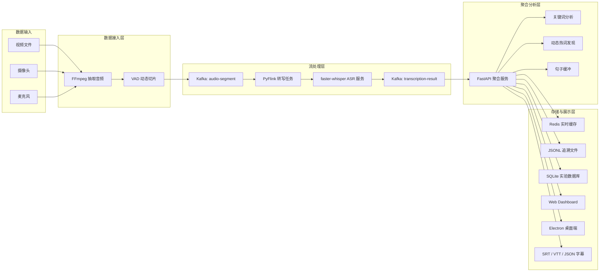
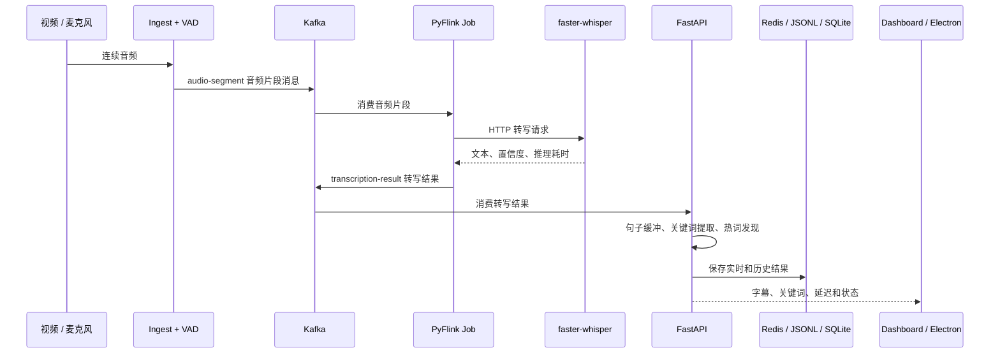

# StreamSense

基于 Kafka-Flink 的视频流语音转写与关键词分析系统

StreamSense 是一个面向中文视频的课程设计项目。系统将视频中的语音转换为持续到达的音频片段，经 Kafka 缓冲、Flink 流式调度和本地 faster-whisper 识别后，实时输出字幕、关键词、热词和运行指标。


## 1. 项目目标

普通“视频转字幕”脚本只能一次处理一个文件，难以体现大数据课程中的消息队列、流式计算、服务解耦和指标监控。StreamSense 将这一需求拆成一条完整的数据链路：

```text
视频文件 / 摄像头 / 麦克风
  -> FFmpeg 抽取音频
  -> VAD 按语音停顿切片
  -> Kafka: audio-segment
  -> Flink 持续消费并调用 ASR
  -> faster-whisper 本地语音识别
  -> Kafka: transcription-result
  -> FastAPI 聚合字幕、提取关键词、发现热词
  -> Redis / JSONL / SQLite / Dashboard / 字幕文件
```

项目重点不是“调用一次语音识别”，而是让语音数据可以持续进入、被缓冲、被处理、被观测、被保存并被导出。

## 2. 核心功能

| 功能 | 实现说明 |
| --- | --- |
| 真实视频接入 | 使用 FFmpeg 读取视频音轨，支持文件、RTSP 或 HTTP/FLV 地址。 |
| VAD 动态切片 | 按语音停顿拆分音频，减少固定长度切片造成的断句问题。 |
| Kafka 消息队列 | 使用 Topic 传递音频片段、转写结果、关键词事件、失败事件和动态热词。 |
| Flink 流式处理 | PyFlink 作业持续消费音频片段，调用 ASR 服务并将结果写回 Kafka。 |
| 本地语音识别 | 使用 faster-whisper，避免将课程演示依赖在付费在线接口上。 |
| 关键词分析 | 使用自定义词表、TextRank 和词频兜底提取关键词。 |
| 动态热词 | 从近期转写文本中累计候选词，并支持确认、忽略和纠正。 |
| 结果存储 | Redis 保存实时数据，JSONL 用于追溯，SQLite 用于统计查询。 |
| 可视化展示 | FastAPI 自带 Dashboard；另提供离线和实时 Electron 桌面端。 |
| 可验收性 | 提供健康检查、Kafka Topic 检查、冒烟测试、压测和字幕质量评测脚本。 |

## 3. 技术架构

### 3.1 系统结构图



### 3.2 模块关系图

```mermaid
flowchart TD
    Root["StreamSense 视频流语音分析系统"]
    Root --> RealTime["实时流处理主链路"]
    Root --> Offline["离线字幕交付链路"]
    Root --> Agent["可选 AI 字幕增强链路"]
    Root --> Quality["实验与验收工具"]

    RealTime --> RT1["services/ingest: 视频接入与 VAD"]
    RealTime --> RT2["Kafka: 消息缓冲与解耦"]
    RealTime --> RT3["flink: 流式调度"]
    RealTime --> RT4["services/asr: 本地语音识别"]
    RealTime --> RT5["services/api: 聚合、关键词、热词"]

    Offline --> OF1["tools/generate_video_subtitles.py"]
    Offline --> OF2["desktop-ui: 离线桌面端"]
    Offline --> OF3["SRT / VTT / TXT / JSON"]

    Agent --> AG1["subtitle-agent: RAG 上下文"]
    Agent --> AG2["LLM 审校与术语统一"]
    Agent --> AG3["ASS 样式字幕与审校报告"]

    Quality --> QA1["tools/smoke_check.py"]
    Quality --> QA2["tools/benchmark_streamsense.py"]
    Quality --> QA3["tools/evaluate_subtitles.py"]
```



### 3.3 实时数据流图



| 层次 | 主要技术 | 对应目录 | 职责 |
| --- | --- | --- | --- |
| 数据接入层 | FFmpeg、WebRTC VAD | `services/ingest/` | 将视频音频转换为带时间戳的语音片段。 |
| 消息队列层 | Kafka、Zookeeper | `docker-compose.yml` | 解耦接入、流处理、识别和分析服务。 |
| 流处理层 | PyFlink | `flink/` | 持续消费片段、调度 ASR、记录阶段耗时和失败事件。 |
| 推理层 | FastAPI、faster-whisper | `services/asr/` | 加载本地 ASR 模型并提供转写接口。 |
| 聚合分析层 | FastAPI、jieba、Redis、SQLite | `services/api/` | 句子缓冲、关键词提取、热词发现、结果持久化和 API。 |
| 展示层 | HTML/CSS/JS、Electron、React | `services/api/static/`、`desktop-ui-live/` | 展示实时字幕、关键词、延迟和系统状态。 |
| 扩展能力 | RAG、LLM、Textual | `subtitle-agent/` | 对离线字幕做术语统一、语义审校和样式化导出。 |

核心 Kafka Topic：

| Topic | 数据内容 |
| --- | --- |
| `audio-segment` | 音频片段路径、视频流 ID、起止时间和创建时间。 |
| `transcription-result` | ASR 文本、推理耗时、Flink 耗时和处理状态。 |
| `keyword-event` | 关键词列表和主题变化事件。 |
| `streamsense.hotword.updates` | 动态热词更新。 |
| `transcription-failed` | 多次重试后仍失败的片段。 |

## 4. 目录结构

```text
.
├── config/                    # 关键词、纠错表和领域 Profile
├── data/
│   ├── audio/.gitkeep         # 运行时音频切片目录
│   ├── reference/.gitkeep     # 人工参考文本目录
│   └── results/.gitkeep       # 运行结果目录
├── desktop-ui/                # 离线字幕 Electron 桌面端
├── desktop-ui-live/           # 实时字幕 Electron 桌面端
├── docs/                      # 原理、实验、评测和使用文档
├── examples/                  # 可直接浏览的脱敏示范案例
├── flink/                     # PyFlink 流处理作业
├── models/.gitkeep            # 本地 ASR 模型缓存目录
├── services/
│   ├── api/                   # 聚合 API、Dashboard、Redis 和 SQLite
│   ├── asr/                   # faster-whisper 本地识别服务
│   └── ingest/                # 视频接入和 VAD 切片
├── subtitle-agent/            # 可选的 AI 字幕精修 Agent
├── tools/                     # 离线生成、评测、压测和验收脚本
├── videos/.gitkeep            # 本地测试视频目录
├── .env.example               # 实时链路配置模板
└── docker-compose.yml         # 完整后端编排
```

## 5. 快速开始

### 5.1 环境要求

- Windows 10/11 或 Linux
- Docker Desktop 和 Docker Compose
- NVIDIA GPU 与可用的 Docker GPU 环境
- FFmpeg
- Python 3.11 以上版本

默认配置面向 NVIDIA GPU：`large-v3 + cuda + float16`。如果机器资源不足，可在 `.env` 中改成：

```env
ASR_MODEL=medium
ASR_DEVICE=cpu
ASR_COMPUTE_TYPE=int8
```

CPU 模式还需要删除或注释 `docker-compose.yml` 中 `asr` 服务的 `gpus: all`。该配置用于把 NVIDIA GPU 暴露给容器，在没有可用 GPU 的机器上不能保留。

### 5.2 准备测试视频

仓库不会提交视频文件。请自行准备一段中文视频，并放到：

```text
videos/input.mp4
```

### 5.3 启动完整实时链路

在项目根目录执行：

```powershell
Copy-Item .env.example .env
docker compose up -d --build
```

首次启动时，ASR 服务需要下载本地模型，耗时取决于模型大小和网络速度。

启动后可访问：

| 页面 | 地址 | 用途 |
| --- | --- | --- |
| StreamSense Dashboard | http://localhost:8000 | 查看实时字幕、关键词和指标。 |
| API 健康检查 | http://localhost:8000/health | 确认聚合服务是否正常。 |
| ASR 健康检查 | http://localhost:8001/health | 确认模型是否已加载。 |
| Flink Web UI | http://localhost:8081 | 查看流处理作业。 |

### 5.4 验证运行状态

```powershell
docker compose ps
python tools/smoke_check.py
```

`smoke_check.py` 会检查：

1. API 和 ASR 健康状态。
2. Flink 是否存在运行中的作业。
3. Docker Compose 核心服务是否启动。
4. Kafka Topic 是否完整。
5. 指标接口是否可访问。

### 5.5 停止服务

```powershell
docker compose down
```

## 6. 示例案例

仓库提供了一份脱敏后的完整示例：[examples/README.md](./examples/README.md)。

示例模拟一段“大数据课程介绍”视频，展示音频切片经过 Kafka、Flink 和 ASR 后，如何生成字幕、关键词事件和指标摘要。

示例字幕：

```text
00:00:00,000 --> 00:00:05,200
本节课介绍 Kafka 在实时数据处理中的作用。

00:00:05,200 --> 00:00:10,800
音频片段会先进入消息队列，再由 Flink 持续消费。
```

示例关键词：

```json
{
  "event_type": "custom_hit",
  "keywords": ["Kafka", "实时数据", "消息队列", "Flink"]
}
```

## 7. 常用操作

### 7.1 查询实时接口

```powershell
Invoke-RestMethod http://localhost:8000/api/status
Invoke-RestMethod http://localhost:8000/api/metrics
Invoke-RestMethod http://localhost:8000/api/transcripts?limit=10
Invoke-RestMethod http://localhost:8000/api/keywords?limit=10
Invoke-RestMethod http://localhost:8000/api/failed-segments
```

### 7.2 导出某一路实时字幕

```text
GET http://localhost:8000/api/streams/demo-video/export?format=srt
GET http://localhost:8000/api/streams/demo-video/export?format=vtt
GET http://localhost:8000/api/streams/demo-video/export?format=json
```

### 7.3 生成离线字幕

完整后端启动后，可以直接将本地视频转换为字幕文件：

```powershell
python tools/generate_video_subtitles.py `
  --media-path videos/input.mp4 `
  --output-dir data/results/demo_input `
  --basename demo_input
```

输出目录通常包括：

```text
data/results/demo_input/
├── demo_input.srt
├── demo_input.vtt
├── demo_input_subtitle.txt
├── demo_input_final_segments.json
├── demo_input_hotwords.json
└── demo_input_report.json
```

### 7.4 字幕质量评测

准备人工参考文本后执行：

```powershell
python tools/evaluate_subtitles.py `
  --candidate data/results/demo_input/demo_input.vtt `
  --reference data/reference/demo_input_reference.txt `
  --output-dir data/results/evaluation `
  --basename demo_input
```

评测脚本会生成 CER、WER 和关键词命中率等指标。详细说明见 [docs/字幕质量评测说明.md](./docs/字幕质量评测说明.md)。

### 7.5 多路视频压测

```powershell
python tools/benchmark_streamsense.py --help
```

已有实验说明和结果记录：

- [docs/benchmark.md](./docs/benchmark.md)
- [docs/本次性能压测实验报告.md](./docs/本次性能压测实验报告.md)
- [docs/模型对比实验报告.md](./docs/模型对比实验报告.md)

## 8. 两个桌面端

本项目有两个桌面端，它们对应不同用途：

| 目录 | 用途 | 启动方式 |
| --- | --- | --- |
| `desktop-ui/` | 选择已有视频，生成最终字幕文件。 | `npm install` 后执行 `npm run electron:dev` |
| `desktop-ui-live/` | 采集麦克风或摄像头，展示 Kafka-Flink 实时链路。 | `npm install` 后执行 `npm run electron:dev` |

详细说明：

- [desktop-ui/README.md](./desktop-ui/README.md)
- [desktop-ui-live/README.md](./desktop-ui-live/README.md)

## 9. 可选扩展：Subtitle Agent

`subtitle-agent/` 是离线字幕质量增强模块，不影响 Kafka-Flink 主链路运行。它可以通过 OpenAI-compatible LLM API 对字幕做 RAG 上下文检索、错词修正、术语一致性检查、节奏优化和 ASS 样式导出。

```powershell
cd subtitle-agent
python -m venv .venv
.\.venv\Scripts\Activate.ps1
pip install -r requirements.txt
Copy-Item .env.example .env
python app.py
```

该模块需要自行配置 API Key。详细说明见 [subtitle-agent/README.md](./subtitle-agent/README.md)。

## 10. 实验结果

仓库记录了一次真实 Docker 链路压测。测试路径为：

```text
FFmpeg 实时读取 -> VAD -> Kafka -> Flink -> ASR -> Kafka -> API -> Redis/JSONL/metrics
```

| 场景 | 成功片段 | 失败片段 | 平均端到端延迟 | P95 延迟 | 说明 |
| --- | ---: | ---: | ---: | ---: | --- |
| 单路视频 | 83 | 0 | 296086 ms | 467350 ms | 受历史 Kafka 积压影响，不作为干净基准。 |
| 2 路视频 | 230 | 0 | 4084 ms | 6805 ms | 当前最适合作为课程报告中的实验结果。 |
| 4 路视频冒烟 | 39 | 0 | 9865 ms | 14463 ms | 证明多路可运行，但排队延迟明显增加。 |

完整解释见 [docs/本次性能压测实验报告.md](./docs/本次性能压测实验报告.md)。

## 11. 文档索引

| 文档 | 用途 |
| --- | --- |
| [docs/文档导航.md](./docs/文档导航.md) | 阅读顺序和文档分类。 |
| [docs/原理解说.md](./docs/原理解说.md) | Kafka、Flink、ASR、VAD、热词和存储设计。 |
| [docs/新手上手文档.md](./docs/新手上手文档.md) | 从克隆仓库到运行系统的详细步骤。 |
| [docs/自动化验收说明.md](./docs/自动化验收说明.md) | 冒烟测试检查项。 |
| [docs/结果数据库说明.md](./docs/结果数据库说明.md) | Redis、JSONL 和 SQLite 的分工。 |
| [docs/system_metrics.md](./docs/system_metrics.md) | 指标字段和 API。 |
| [docs/Git提交与仓库说明.md](./docs/Git提交与仓库说明.md) | 公开仓库文件边界。 |

## 12. GitHub 发布说明

仓库只应提交源码、配置模板、文档和脱敏示例。以下内容已经通过 `.gitignore` 排除：

```text
.env
subtitle-agent/.env
models/
videos/
data/audio/
data/results/
desktop-ui/node_modules/
desktop-ui/release/
desktop-ui-live/node_modules/
desktop-ui-live/release/
*.docx
```

提交前建议执行：

```powershell
git status --short
git ls-files
```

## 13. 当前限制

- 默认 Docker Compose 配置使用 NVIDIA GPU；CPU 环境需要调整 `.env`。
- 首次运行需要下载 faster-whisper 模型。
- 字幕质量受音频清晰度、模型大小和领域词汇影响。
- LLM 字幕 Agent 是可选增强模块，需要单独配置 API Key。
- 当前系统定位为课程设计和本地实验，不是生产级多节点部署模板。

## License

本项目采用 [MIT License](./LICENSE)。
