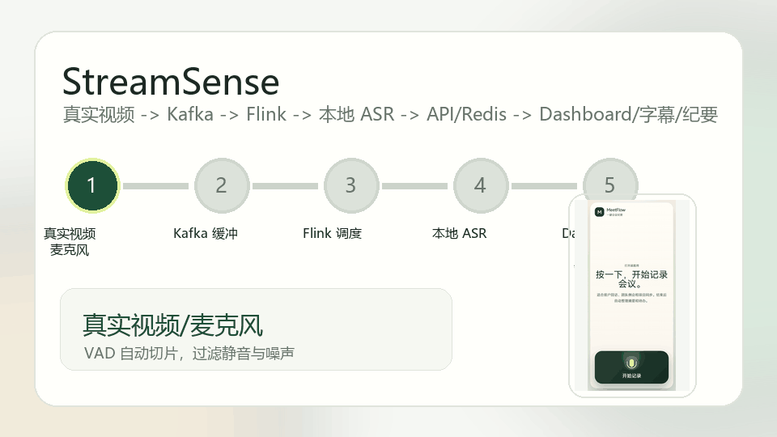
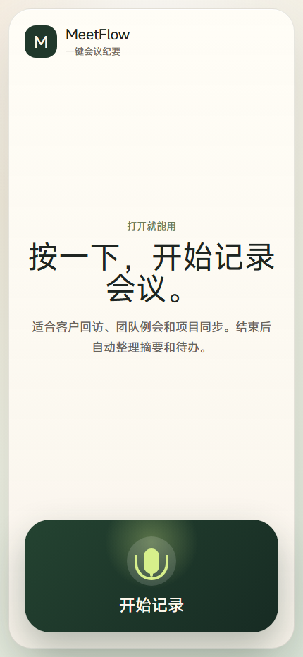
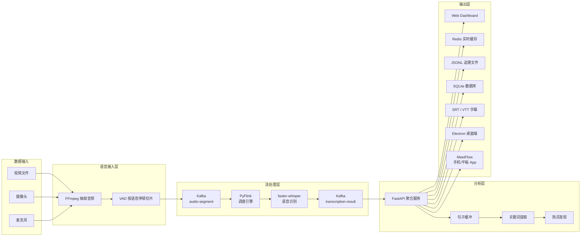
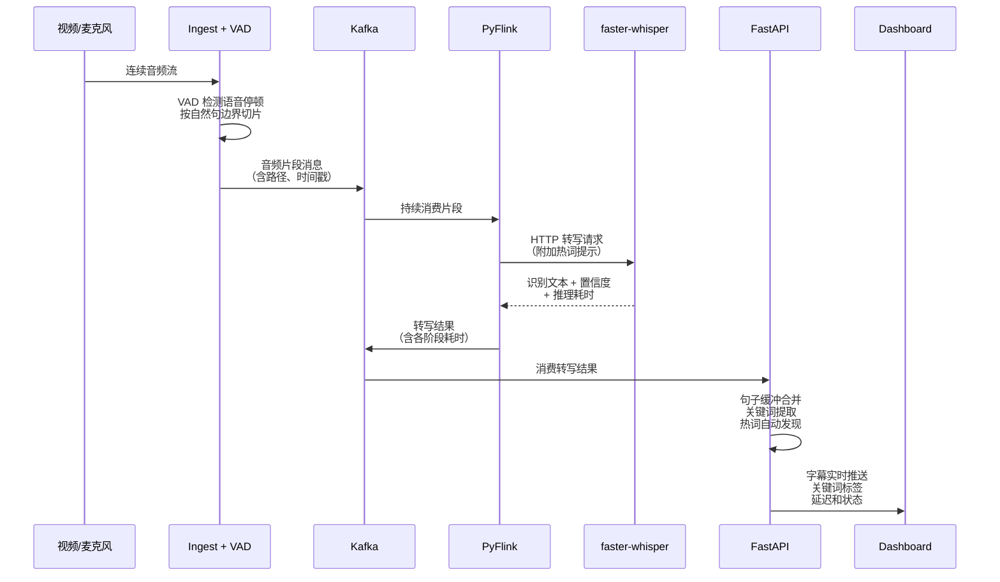

# StreamSense —— 基于 Kafka-Flink 的视频流语音转写与关键词分析系统

[](https://www.python.org/)
[](https://www.docker.com/)
[](./LICENSE)
[](https://flink.apache.org/)

**视频进去，字幕出来。中间发生了什么，你全看得见。**

普通转写工具：丢视频 → 等几分钟 → 下载字幕。中间发生了什么？不知道。

StreamSense 不一样。它把视频语音处理做成了实时流：音频按语音停顿自动切片进入 Kafka，Flink 调度 GPU 推理，字幕逐句生成，关键词同步提取，延迟实时展示。数据流到哪里、卡在哪里、每条数据在每个环节耗时多少毫秒——Dashboard 上全部可查。不是跑完看结果，而是一边跑一边看。

Docker 一行命令启动，多路视频并发处理，SRT/VTT 多格式导出，内建质量评测——从本地验证到项目交付，一步到位。

这套架构的价值不在纸面上，而在具体场景里的可验证性。打开 Dashboard，就能看到数据流到哪里、每步延迟多少、关键词是什么；查询 SQLite，就能导出每条片段的端到端时间线，定位哪个环节慢、慢了多少；运行 `evaluate_subtitles.py`，就能量化 CER、WER 和关键词命中率。StreamSense 把数据处理从黑盒变成可观测、可追溯、可复算的过程，这也是它区别于"调一个 API 出字幕"的核心所在。

放眼更大市场，这套架构的可复制性远不止本地演示环境。在线教育平台需要为海量课程视频自动生成字幕和知识点索引——Kafka-Flink 管线天然支持高并发，GPU 本地化部署保障数据不出内网。企业会议与呼叫中心每天产生数万小时语音，传统方案只能抽样质检，而 StreamSense 的实时流架构可以做到全量转写、关键词触发、异常实时告警。视频内容平台用它做合规审核和广告位匹配，医疗教育用它做医患对话的结构化归档。任何一个需要把"非结构化语音变成可检索、可分析的结构化数据"的行业，都是这套架构的落地空间。数据不出内网、处理实时可见、质量可量化验证——这三个能力组合在一起，构成了面向企业级实时语音分析的技术护城河。

---

## 项目创新点速览

> StreamSense 不是“调用一个语音识别接口”，而是把真实视频/麦克风语音改造成一条可缓冲、可调度、可追踪、可评测、可展示的大数据实时处理链路。

<p align="center">
  
</p>

| 创新点 | 普通做法 | StreamSense 的做法 | 可验证证据 |
| --- | --- | --- | --- |
| **从字幕脚本升级为流式系统** | 单文件一次性转写，跑完才有结果 | `真实视频/麦克风 -> Kafka -> Flink -> ASR -> API -> Dashboard`，每个片段独立进入管线 | Dashboard、Flink Web UI、Kafka Topic、`/api/metrics/history` |
| **流处理工程闭环** | 只展示模型识别结果 | Kafka 解耦、Flink 调度、Redis 缓存、SQLite 统计、Docker Compose 编排全部落地 | `docker-compose.yml`、`flink/transcription_job.py`、`services/api/app.py` |
| **可观测与可复盘** | 看不到中间过程 | 记录端到端延迟、ASR 耗时、调度耗时、吞吐增量、失败片段和历史采样 | `data/results/*.jsonl`、`/api/database/summary`、`docs/结果数据库说明.md` |
| **质量可复算** | 只靠人工浏览字幕 | CER/WER、关键词命中率、字幕条数、缺口数、耗时/视频时长全部量化 | `tools/evaluate_subtitles.py`、`docs/字幕质量评测说明.md` |
| **交付形态完整** | 只能命令行跑脚本 | Web Dashboard、离线 Electron 工作台、实时 Electron 采集端、手机/平板会议纪要 App | `desktop-ui/`、`desktop-ui-live/`、`meeting-assistant-tablet/` |
| **面向真实场景扩展** | 一次性脚本到此为止 | 支持会议、技术讲解、大数据等领域 Profile；支持热词确认、忽略和纠错 | `config/profiles/`、`/api/hotwords/action`、`docs/问题解决与当前限制.md` |

### 近期新增亮点

| 新增能力 | 解决的问题 | 代码/入口 |
| --- | --- | --- |
| Dashboard 实时指标历史增强 | 不只看平均值，还能看到最新片段延迟、ASR 耗时、字幕数量曲线、增量吞吐 | `services/api/app.py`、`services/api/static/app.js` |
| Stream 级别 API | 可以按 `stream_id` 查看详情、片段、热词、导出结果，便于多路并发演示 | `/api/streams`、`/api/streams/{stream_id}/segments` |
| 演示数据一键清理 | 直播或现场验证前可清空某一路历史，不用手动删 JSONL | `DELETE /api/streams/{stream_id}/segments` |
| Live Ingest 降噪与低音量优化 | 平板/笔记本麦克风声音偏小时仍能接入实时链路 | `LIVE_INGEST_MIN_DBFS=-55`、`LIVE_INGEST_MIN_WAV_BYTES=24000` |
| MeetFlow 手机/平板会议纪要 App | 把实时语音链路包装成“按一下开始记录会议”的端侧产品，支持 HTTPS PWA 和 Android APK | `meeting-assistant-tablet/`、React + Vite + Capacitor Android |
| 轻量单元测试 | 无需 Docker/GPU，也能验证字幕评测和冒烟报告基础逻辑 | `python -m unittest discover -s tests -v` |

## 可视化演示

<p align="center">
  
  
</p>

这组截图来自 `meeting-assistant-tablet/` 的实际界面：项目不仅有 Kafka/Flink 后端，也有面向真实会议场景的端侧 App。手机/平板端负责申请麦克风权限、按 1.8 秒录音分片上传到 Live Ingest，后端仍走 StreamSense Kafka-Flink-ASR 链路；App 再轮询 `meetflow-tablet` 流的识别结果，整理为会议摘要、待办和原文摘录。它既可以通过 HTTPS PWA 在局域网中运行，也可以通过 Capacitor 打包为 Android APK。

## 四端交付矩阵

同一条 Kafka-Flink-ASR 主链路被封装成 4 个不同入口，分别面向运行观测、离线生产、实时采集和移动会议场景：

| 交付端 | 代码入口 | 使用场景 | 核心功能 | 输出/验证 |
| --- | --- | --- | --- | --- |
| **Web Dashboard** | `services/api/static/` | 系统运行观测、实时演示、链路排查 | 实时字幕滚动、关键词标签、延迟/吞吐/失败数指标、历史曲线、失败片段列表 | `http://localhost:8000`、`/api/metrics/history` |
| **离线 Electron 工作台** | `desktop-ui/` | 已有视频文件转字幕、字幕质量复核、结果交付 | 选择/拖入视频、选择输出目录、任务进度、领域 Profile、质量报告、字幕时间轴、字幕编辑、SRT/VTT/TXT/JSON/ZIP 导出 | `npm run electron:dev`、`data/results/tasks/<task_id>/` |
| **实时 Electron 采集端** | `desktop-ui-live/` | 摄像头/麦克风实时字幕、大数据链路端到端验证 | 启停 Docker 服务、健康检查、摄像头预览、麦克风分片上传、Live Ingest 写入 Kafka、实时轮询字幕、清空 `desktop-live` 历史 | `docker-compose.live.yml`、`/api/streams/desktop-live/segments` |
| **MeetFlow 手机/平板 App** | `meeting-assistant-tablet/` | 会议记录、移动端采集、轻量纪要生成 | 移动端麦克风权限、1.8 秒音频切片、会议热词上传、实时文字、摘要/待办/原文摘录、PWA 和 Android APK | `npm run dev:https`、`com.streamsense.meetflow` APK |

## 能力覆盖索引

| 能力维度 | README 中可直接看到的内容 | 对应文件 |
| --- | --- | --- |
| 场景定位 | 视频流语音转写天然是实时数据处理场景 | 第 1 节 |
| 技术选型 | Kafka、Flink、Redis、FastAPI、Docker、ASR、VAD 和四端交付分层说明 | 第 2 节 |
| 运行环境 | Docker Compose 一键启动，前后端、桌面端与移动端入口完整 | 第 3 节 |
| 核心架构 | 架构图、时序图、Topic 设计、数据规格 | 第 4-5 节 |
| 功能实现 | 实时字幕、关键词、热词、导出、Dashboard、双桌面端、手机/平板会议纪要、测试 | 第 6 节 |
| 工程质量 | 模块拆分、目录结构、配置外置、关注点分离 | 第 7 节 |
| 实验结果 | 2 路/4 路并发压测、失败数、平均延迟、P95 延迟 | 第 8 节 |
| 文档体系 | 配套文档、问题解决、当前限制、评测说明 | 第 9 节 |

---

## 目录

- [项目创新点速览](#项目创新点速览)
- [可视化演示](#可视化演示)
- [四端交付矩阵](#四端交付矩阵)
- [能力覆盖索引](#能力覆盖索引)
- [0. 快速预览](#0-快速预览)
- [1. 应用场景](#1-应用场景)
- [2. 技术选型](#2-技术选型)
- [3. 运行环境](#3-运行环境)
- [4. 核心架构](#4-核心架构)
- [5. 数据规格](#5-数据规格)
- [6. 功能实现](#6-功能实现)
- [7. 代码组织](#7-代码组织)
- [8. 实验结果](#8-实验结果)
- [9. 文档体系](#9-文档体系)
- [10. 问题解决与工程经验](#10-问题解决与工程经验)
- [11. 当前限制](#11-当前限制)
- [12. 自动化测试与验证矩阵](#12-自动化测试与验证矩阵)
- [13. 端到端验证路径](#13-端到端验证路径)

---

## 0. 快速预览

### 快速启动

```powershell
# 1. 把视频丢进 videos/ 目录
cp 你的视频.mp4 videos/input.mp4

# 2. 一行命令启动全部服务
docker compose up -d --build

# 3. 打开浏览器看实时转写
# http://localhost:8000
```

视频放入 `videos/`，启动 Docker，打开浏览器——字幕实时滚动，关键词同步提取，延迟曲线实时跳动。

### 启动后能做什么

| 做什么              | 怎么操作                                                                                                             |
| ------------------- | -------------------------------------------------------------------------------------------------------------------- |
| 看实时字幕和关键词  | 浏览器打开 `http://localhost:8000`                                                                                 |
| 导出 SRT/VTT 字幕   | `http://localhost:8000/api/streams/demo-video/export?format=srt`                                                   |
| 查看 Flink 作业状态 | `http://localhost:8081`                                                                                            |
| 检查系统是否正常    | `python tools/smoke_check.py`（6 项自动检查）                                                                      |
| 生成离线字幕文件    | `python tools/generate_video_subtitles.py --media-path videos/input.mp4 --output-dir data/results/demo`            |
| 评测字幕质量        | `python tools/evaluate_subtitles.py --candidate data/results/demo/xxx.vtt --reference data/reference/参考文本.txt` |
| 多路并发压测        | `python tools/benchmark_streamsense.py --help`                                                                     |
| 使用桌面端          | `desktop-ui/`（离线字幕）和 `desktop-ui-live/`（实时采集）分别 `npm install && npm run electron:dev`           |
| 使用手机/平板会议纪要 App | `cd meeting-assistant-tablet && npm run dev:https`，移动设备同 Wi-Fi 访问 Vite HTTPS 地址；也可用 Capacitor 构建 Android APK |
| 查看历史指标曲线    | `http://localhost:8000/api/metrics/history`，支持 `?stream_id=desktop-live`                                       |
| 清空一路演示数据    | `DELETE http://localhost:8000/api/streams/{stream_id}/segments`，现场验证前可重置                                 |
| 跑轻量单元测试      | `python -m unittest discover -s tests -v`（无需 Docker/GPU）                                                       |

### 实测数据（2 路视频并发）

| 指标           | 数值               |
| -------------- | ------------------ |
| 处理片段数     | 230 个（全部成功） |
| 平均端到端延迟 | 约 4 秒            |
| P95 延迟       | 约 6.8 秒          |
| 失败片段       | 0 个               |

---

## 1. 应用场景

### 为什么选"视频语音转写"？

视频语音转写是一个**天然适合大数据管线**的场景：

1. **数据本身是"流"**：视频音频是持续到达的，不是一次性文件处理，天然适合流式计算
2. **问题可拆解**：从音频采集到字幕输出，中间需要缓冲、调度、识别、分析、存储，每一步都能独立验证和扩展
3. **效果看得见**：不像纯后端系统只能看日志，转写结果直接以字幕形式呈现，Dashboard 可视化可直观展示系统运行状态

### 与传统"视频转字幕脚本"的区别

| 维度     | 普通脚本           | StreamSense                                         |
| -------- | ------------------ | --------------------------------------------------- |
| 处理方式 | 整个视频一次性转写 | 音频按语音停顿切片，流式进入 Kafka                  |
| 扩展性   | 单文件串行处理     | Flink 按 stream_id 并行调度多路视频                 |
| 容错性   | 出错从头再来       | 失败片段进入死信队列，支持追踪和复查                |
| 可观测性 | 跑完才知道结果     | Dashboard 实时展示每条数据的处理状态                |
| 输出     | 一个字幕文件       | 字幕 + 关键词 + 热词 + 指标 + 数据库                |
| 工程覆盖 | 只涉及 API 调用    | Kafka + Flink + VAD + ASR + Redis + SQLite + Docker |

---

## 2. 技术选型

每种技术的选择都有明确的工程原因。按层次分组如下：

### 基础设施与容器化

| 技术                          | 版本   | 解决的问题                                   | 工程关注点 |
| ----------------------------- | ------ | -------------------------------------------- | ---------- |
| **Docker**              | -      | 统一开发与运行环境，消除"在我机器上能跑"问题 | 容器化     |
| **Docker Compose**      | -      | 9 个服务的一键编排与启动                     | 服务编排   |
| **NVIDIA CUDA + cuDNN** | 12.4.1 | GPU 加速推理                                 | GPU 计算   |

### 消息队列

| 技术                       | 版本              | 解决的问题                                         | 工程关注点                  |
| -------------------------- | ----------------- | -------------------------------------------------- | --------------------------- |
| **Apache Kafka**     | 7.6.1 (Confluent) | 音频片段、转写结果、关键词事件、热词更新的异步传递 | 消息队列、生产者/消费者模型 |
| **Apache ZooKeeper** | 7.6.1             | Kafka 集群元数据管理与协调                         | 分布式协调                  |
| **aiokafka**         | 0.12.0            | API 与 ASR 服务的异步 Kafka 消费与生产             | 异步 I/O、消息队列          |
| **kafka-python**     | 2.0.2             | Ingest 服务的同步 Kafka 生产                       | 消息队列                    |

### 流式计算

| 技术                                | 版本       | 解决的问题                                          | 工程关注点 |
| ----------------------------------- | ---------- | --------------------------------------------------- | ---------- |
| **Apache Flink**              | 1.18.1     | 流处理引擎：消费 Kafka 音频片段、调度 ASR、写回结果 | 流式计算   |
| **PyFlink**                   | 1.18.1     | Flink DataStream API 的 Python 绑定                 | 流式计算   |
| **flink-sql-connector-kafka** | 3.1.0-1.18 | Flink 与 Kafka 的连接器                             | 流式计算   |

### 语音处理

| 技术                       | 版本                | 解决的问题                                 | 工程关注点       |
| -------------------------- | ------------------- | ------------------------------------------ | ---------------- |
| **FFmpeg**           | -                   | 视频音频提取、格式转换、静音检测           | 多媒体处理       |
| **WebRTC VAD**       | 2.0.14              | 按语音停顿动态切片，避免固定切片的断句问题 | 语音信号处理     |
| **faster-whisper**   | 1.1.0 (CTranslate2) | 本地语音识别，离线可用、GPU 加速           | 机器学习模型部署 |
| **Whisper large-v3** | -                   | 语音识别的预训练模型                       | 深度学习模型     |
| **hf_transfer**      | 0.1.9               | 加速 Hugging Face 模型下载                 | 模型管理         |

### 后端服务

| 技术                       | 版本    | 解决的问题                                 | 工程关注点         |
| -------------------------- | ------- | ------------------------------------------ | ------------------ |
| **FastAPI**          | 0.115.6 | API 服务的 Web 框架，自动生成 OpenAPI 文档 | Web 服务、REST API |
| **uvicorn**          | 0.34.0  | ASGI 服务器，运行 FastAPI 应用             | Web 服务           |
| **pydantic**         | 2.10.4  | 请求/响应数据校验                          | 数据验证           |
| **python-multipart** | 0.0.20  | 桌面端音频上传的表单解析                   | HTTP 文件上传      |

### 存储

| 技术             | 版本          | 解决的问题                         | 工程关注点           |
| ---------------- | ------------- | ---------------------------------- | -------------------- |
| **Redis**  | 7-alpine      | Dashboard 实时数据缓存，毫秒级查询 | 缓存系统、内存数据库 |
| **SQLite** | Python stdlib | 结构化实验数据持久化，支持统计查询 | 关系型数据库         |
| **JSONL**  | -             | 追加式日志存储，支持实验追溯与回放 | 数据持久化           |

### 中文 NLP

| 技术             | 版本   | 解决的问题                                      | 工程关注点   |
| ---------------- | ------ | ----------------------------------------------- | ------------ |
| **jieba**  | 0.42.1 | 中文分词、TextRank 关键词提取、词性标注         | 自然语言处理 |
| **OpenCC** | 0.1.7  | 繁简体中文统一转换（Traditional → Simplified） | 文本预处理   |

### 前端、桌面端与移动端

| 技术 | 版本 | 解决的问题 | 工程关注点 |
| --- | --- | --- | --- |
| **HTML / CSS / JavaScript** | - | Dashboard 的实时字幕、关键词、延迟曲线和 Stream 管理 | Web 可视化 |
| **Electron** | 39 | 离线字幕工作台、实时采集桌面端 | 桌面应用开发 |
| **React** | 19 | 桌面端与移动端 UI 组件化开发 | 前端开发 |
| **TypeScript** | 5.9 | 类型安全的前端逻辑、录音状态和 API 数据结构 | 编程语言 |
| **Vite** | 7 | Dashboard 外的前端开发服务器与构建流水线 | 前端工程化 |
| **electron-builder** | 26 | Windows 桌面端安装包打包与分发 | 软件分发 |
| **MediaRecorder / getUserMedia** | Web API | 移动端浏览器/Android WebView 录音、音频分片上传 | 端侧音频采集 |
| **Web Speech API** | Web API | 后端暂不可用时提供浏览器识别兜底 | 低延迟兜底 |
| **PWA / HTTPS Dev** | - | 局域网移动设备获取麦克风权限、添加到桌面运行 | 移动端体验 |
| **Capacitor Core / Android** | 8.4 | 将 MeetFlow Web App 封装为 Android APK | 移动端封装 |
| **Android SDK / Gradle** | minSdk 24, targetSdk 36 | 生成 `com.streamsense.meetflow` debug APK，声明麦克风与网络权限 | Android 构建 |

### 四个前端入口的职责边界

| 入口 | 技术组合 | 负责的功能 | 不负责什么 |
| --- | --- | --- | --- |
| **Web Dashboard** | FastAPI Static + 原生 JS/CSS | 展示实时字幕、关键词、失败片段、延迟曲线、吞吐增量、系统状态 | 不直接采集音频，不编辑字幕 |
| **离线 Electron 工作台** | Electron + React + Python 工具链 | 本地视频选择、字幕生成任务、质量报告、字幕预览/编辑、多格式导出 | 不承担实时 Kafka/Flink 采集 |
| **实时 Electron 采集端** | Electron + React + Live Ingest | 启动实时服务、采集摄像头/麦克风、分片上传、轮询 `desktop-live` 字幕、清理实时流历史 | 不做离线字幕编辑和会议纪要摘要 |
| **MeetFlow 手机/平板 App** | React + Vite + Capacitor Android | 移动端录音、会议热词、实时文字、摘要/待办/原文摘录、PWA/APK 分发 | 不展示后台指标和运维控制台 |

### MeetFlow 移动端 App

移动端代码位于 `meeting-assistant-tablet/`，定位不是后台监控页，而是面向会议现场的轻量 App：

| 能力 | 实现方式 | 对应代码/配置 |
| --- | --- | --- |
| 端侧录音 | `getUserMedia` 申请麦克风，`MediaRecorder` 每 1.8 秒生成一段 `webm/opus` 音频 | `meeting-assistant-tablet/src/App.tsx` |
| 实时上传 | 表单上传到 `/live/audio`，携带 `stream_id`、`run_id`、`chunk_index` 和会议热词 | `LIVE_INGEST_URL`、`HOTWORDS` |
| 后端识别 | Live Ingest 将音频接入 StreamSense，后续仍由 Kafka、Flink、ASR、API 处理 | `desktop-ui-live/live-ingest/`、`services/api/` |
| 实时回显 | App 每 0.7 秒轮询 `/api/streams/meetflow-tablet/segments`，合并本次会议文本 | `POLL_MS=700` |
| 纪要生成 | 根据真实识别文本提取标题、摘要、待办和原文摘录；无清晰内容时明确提示 | `buildMinutes()` |
| Android 打包 | Capacitor WebView 壳，包名 `com.streamsense.meetflow`，声明 `RECORD_AUDIO` 和 `INTERNET` 权限 | `capacitor.config.ts`、`android/app/src/main/AndroidManifest.xml` |

### 可选扩展（AI 字幕增强）

| 技术                                | 版本     | 解决的问题                           | 工程关注点     |
| ----------------------------------- | -------- | ------------------------------------ | -------------- |
| **Textual**                   | ≥0.85.0 | 终端交互式 UI（TUI）框架             | 交互式应用     |
| **OpenAI-compatible LLM API** | -        | 字幕的上下文审校、术语统一、语义润色 | 大语言模型应用 |
| **RAG**                       | -        | 基于领域知识库的检索增强生成         | 检索增强生成   |

### 字幕格式与评测

| 技术                   | 用途                              |
| ---------------------- | --------------------------------- |
| **SRT** (SubRip) | 标准字幕格式，兼容主流视频播放器  |
| **VTT** (WebVTT) | Web 标准字幕格式，兼容 HTML5 视频 |
| **CER / WER**    | 字错率 / 词错率，衡量字幕识别质量 |
| **MIT License**  | 开源许可协议                      |

---

## 3. 运行环境

### 3.1 需要什么

| 软件                            | 用途                           |
| ------------------------------- | ------------------------------ |
| Docker Desktop + Docker Compose | 运行全部后端服务               |
| FFmpeg                          | 视频音频提取                   |
| Python 3.11+                    | 运行离线工具脚本               |
| Node.js + npm                   | 运行 React/Electron/MeetFlow 前端 |
| Android SDK + JDK 21（可选）    | 构建 MeetFlow Android debug APK |
| NVIDIA GPU（推荐）              | 加速语音识别；CPU 模式也可运行 |

### 3.2 依赖文件怎么分

这个仓库不是单个 Python 脚本，而是多服务工程。依赖按服务拆分，根目录 `requirements.txt` 只作为本地工具和测试的入口说明，避免一次性把 PyFlink、faster-whisper、CUDA 推理依赖全部装到同一个环境里。

| 依赖文件 | 对应模块 | 主要依赖 | 什么时候需要 |
| --- | --- | --- | --- |
| `requirements.txt` | 根目录工具与轻量测试 | 当前只用 Python 标准库 | 运行 `tools/smoke_check.py`、`tools/evaluate_subtitles.py`、`python -m unittest` |
| `services/api/requirements.txt` | API + Dashboard 聚合服务 | FastAPI、aiokafka、Redis、jieba、pydantic | 本地运行 API 或构建 `streamsense-api` 容器 |
| `services/asr/requirements.txt` | ASR 识别服务 | faster-whisper、OpenCC、FastAPI、aiokafka | 本地运行 ASR 或构建 `streamsense-asr` 容器 |
| `services/ingest/requirements.txt` | 视频接入服务 | kafka-python、webrtcvad-wheels | 本地运行视频接入或构建 ingest 容器 |
| `flink/requirements.txt` | PyFlink 作业 | apache-flink、requests | 本地调试 Flink 作业或构建 Flink 镜像 |
| `desktop-ui-live/live-ingest/requirements.txt` | 实时麦克风接入服务 | FastAPI、kafka-python、python-multipart | 运行实时桌面端或手机/平板 App 的 `/live/audio` 接入 |
| `subtitle-agent/requirements.txt` | 可选 AI 字幕增强 | textual | 使用字幕增强 TUI/Agent |
| `*/package.json` | 桌面端、实时端、移动端 | Electron、React、Vite、Capacitor | 运行或打包前端客户端 |

常用命令：

```powershell
# 本地工具/测试：当前无额外第三方依赖，但保留统一入口
python -m pip install -r requirements.txt

# 某个服务需要脱离 Docker 本地运行时，再安装对应依赖
python -m pip install -r services/api/requirements.txt
python -m pip install -r services/asr/requirements.txt
python -m pip install -r desktop-ui-live/live-ingest/requirements.txt
```

### 3.3 三步启动

```powershell
# 1. 配置环境
Copy-Item .env.example .env

# 2. 一键启动全部服务（Kafka、Flink、ASR、API、Redis、Dashboard）
docker compose up -d --build

# 3. 放入测试视频，开始转写
# 将视频放到 videos/input.mp4，系统自动处理
```

首次启动时 ASR 服务会自动下载模型（约 3GB），耗时取决于网络。

### 3.4 启动后可访问

| 页面                | 地址                         | 用途                       |
| ------------------- | ---------------------------- | -------------------------- |
| **Dashboard** | http://localhost:8000        | 实时字幕、关键词、指标曲线 |
| API 健康检查        | http://localhost:8000/health | 确认聚合服务正常           |
| ASR 健康检查        | http://localhost:8001/health | 确认模型已加载             |
| Flink Web UI        | http://localhost:8081        | 查看流处理作业状态         |

### 3.5 验证系统运行

```powershell
docker compose ps                    # 查看所有服务状态
python tools/smoke_check.py          # 6 项自动检查
```

`smoke_check.py` 自动检查：① API 健康 ② ASR 健康 ③ Flink 作业 ④ Docker 核心服务 ⑤ Kafka Topic 完整性 ⑥ 指标接口可访问性。

> CPU 环境：修改 `.env` 中 `ASR_MODEL=medium`、`ASR_DEVICE=cpu`、`ASR_COMPUTE_TYPE=int8`，并删除 `docker-compose.yml` 中 `asr` 服务的 `gpus: all`。

---

## 4. 核心架构

### 4.1 数据是如何流动的？

整个系统像一条**流水线**，每个环节只做一件事，通过 Kafka（消息队列）传递数据：



### 4.2 每一步发生了什么？



### 4.3 架构层次一览

| 层次     | 技术                             | 代码位置                                       | 职责                                   |
| -------- | -------------------------------- | ---------------------------------------------- | -------------------------------------- |
| 数据接入 | FFmpeg + WebRTC VAD              | `services/ingest/`                           | 视频音频抽取、按语音停顿切片           |
| 消息队列 | Kafka + Zookeeper                | `docker-compose.yml`                         | 解耦各服务，5 个 Topic 分工明确        |
| 流处理   | PyFlink                          | `flink/`                                     | 消费片段、调度 ASR、记录耗时、失败路由 |
| 语音识别 | FastAPI + faster-whisper         | `services/asr/`                              | 加载本地模型、GPU 推理、质量过滤       |
| 聚合分析 | FastAPI + jieba + Redis + SQLite | `services/api/`                              | 句子合并、关键词提取、热词发现、持久化 |
| 可视化与端侧 | HTML/CSS/JS + Electron + React + Capacitor | `services/api/static/`、`desktop-ui-live/`、`meeting-assistant-tablet/` | 实时 Dashboard、桌面端、手机/平板 App |
| AI 增强  | RAG + LLM                        | `subtitle-agent/`                            | 可选：术语统一、语义审校、样式字幕     |

### 4.4 Kafka 五个 Topic 的分工

| Topic                           | 传递什么数据                     | 谁生产      | 谁消费           |
| ------------------------------- | -------------------------------- | ----------- | ---------------- |
| `audio-segment`               | 音频切片的路径、时间戳、来源信息 | Ingest 服务 | Flink 作业       |
| `transcription-result`        | 识别文本、各阶段耗时、置信度     | Flink 作业  | API 服务         |
| `keyword-event`               | 提取的关键词、主题变化事件       | API 服务    | （供下游扩展）   |
| `streamsense.hotword.updates` | 动态发现的热词列表               | API 服务    | ASR 服务         |
| `transcription-failed`        | 重试后仍失败的片段               | Flink 作业  | API 服务（追踪） |

---

## 5. 数据规格

整个系统的数据格式设计遵循统一原则：**每个环节保留完整的时间戳，可以精确追踪每条数据在链路中的停留时间**。

### 5.1 音频片段消息（`audio-segment` Topic）

音频数据不直接放入 Kafka（体积太大），而是将音频保存为 WAV 文件，消息中携带文件路径和元信息：

```json
{
  "segment_id":       "demo-video-a3f2b1c0-000001",
  "stream_id":        "demo-video",
  "run_id":           "a3f2b1c0",
  "file_path":        "/data/audio/demo-video_a3f2b1c0_000001.wav",
  "start_time":       0.0,
  "end_time":         3.0,
  "duration":         3.0,
  "start_time_ms":    0,
  "end_time_ms":      3000,
  "duration_ms":      3000,
  "sample_rate":      16000,
  "created_at":       1713960000123,
  "kafka_sent_at":    1713960000456,
  "source_type":      "file"
}
```

> **关键字段说明**：`start_time_ms`/`end_time_ms` 记录这段音频在原视频中的位置；`kafka_sent_at` 标记消息何时发送到 Kafka；`sample_rate=16000` 表示 16kHz 单声道 WAV，这是语音识别的标准输入格式。

### 5.2 转写结果消息（`transcription-result` Topic）

Flink 调用 ASR 后将识别结果与性能数据合并，写回 Kafka：

```json
{
  "segment_id":       "demo-video-a3f2b1c0-000001",
  "stream_id":        "demo-video",
  "session_id":       "demo-video:a3f2b1c0",
  "text":             "本节课介绍 Kafka 在实时数据处理中的作用",
  "language":         "zh",
  "language_probability": 0.98,
  "segments": [
    {
      "start": 0.0, "end": 1.5,
      "text": "本节课介绍 Kafka",
      "avg_logprob": -0.32,
      "no_speech_prob": 0.05
    }
  ],
  "audio_dbfs":       -22.5,
  "hotwords_used":    ["Kafka", "Flink"],
  "inference_time_ms": 1180,
  "model":            "large-v3",
  "device":           "cuda",
  "compute_type":     "float16",
  "status":           "ok",
  "retry_count":      0,
  "end_to_end_time_ms": 1788,
  "flink_process_time_ms": 1300,
  "kafka_flink_dispatch_time_ms": 44
}
```

> **关键字段说明**：`text` 是识别出的中文文本；`segments` 是 Whisper 模型输出的逐段结果，包含 `avg_logprob`（平均对数概率，衡量识别置信度）和 `no_speech_prob`（无语音概率，用于过滤静音段）；`end_to_end_time_ms` 是从音频创建到结果写回的总耗时；`status: "ok"` 表示处理成功。

### 5.3 关键词事件消息（`keyword-event` Topic）

API 服务对每个完整句子提取关键词后发布：

```json
{
  "event_id":         "e7f3a1b2c4d5",
  "stream_id":        "demo-video",
  "session_id":       "demo-video:a3f2b1c0",
  "event_type":       "custom_hit",
  "keywords": [
    {"word": "Kafka",      "score": 1.0, "source": "custom"},
    {"word": "实时数据",    "score": 1.0, "source": "custom"},
    {"word": "消息队列",    "score": 0.85, "source": "textrank"}
  ],
  "source_text":      "本节课介绍 Kafka 在实时数据处理中的作用",
  "start_time_ms":    0,
  "end_time_ms":      5200,
  "created_at_ms":    1713960020000
}
```

> **事件类型说明**：`custom_hit`——命中了自定义词表中的关键词（优先展示）；`keyword`——通过 TextRank 算法从文本中自动提取；`topic_shift`——当前句子的关键词与上一句重叠度低于阈值（35%），表示话题可能发生了变化。

### 5.4 热词更新消息（`streamsense.hotword.updates` Topic）

系统自动从转写文本中发现高频专业词汇，广播给 ASR 服务用于提升后续识别准确率：

```json
{
  "stream_id":  "demo-video",
  "session_id": "demo-video:a3f2b1c0",
  "terms": [
    {
      "word":          "Kafka",
      "count":         15,
      "recent_count":  5,
      "score":         17.5,
      "source":        "auto_discovery",
      "confirmed":      true
    }
  ],
  "created_at_ms": 1713960025000
}
```

> **热词自动学习机制**：系统维护一个 5 分钟的滑动窗口，统计近期转写文本中名词和动词的出现频率。当某个词的出现次数超过阈值（默认 5 次）且平均识别置信度达标时，自动加入热词列表并广播给 ASR 服务——下一轮识别就会带上这个词作为提示，形成"越识别越准"的正向循环。

### 5.5 存储策略：三层分工

| 存储层                     | 存什么                         | 用途                                   |
| -------------------------- | ------------------------------ | -------------------------------------- |
| **Redis**（内存）    | 最近 200 条字幕 + 500 条关键词 | Dashboard 实时查询，毫秒级响应         |
| **JSONL**（文件）    | 每条转写结果追加一行 JSON      | 实验追溯、Bug 排查、写报告时回溯       |
| **SQLite**（数据库） | 结构化统计表                   | 按 stream 查平均延迟、成功率、重试次数 |

---

## 6. 功能实现

### 6.1 核心功能清单

| 功能                          | 实现方式                                           | 验证方式                                  |
| ----------------------------- | -------------------------------------------------- | ----------------------------------------- |
| **视频接入**            | FFmpeg 读取音轨，支持本地文件、RTSP、HTTP/FLV      | 实时 Dashboard 可观察                     |
| **VAD 动态切片**        | WebRTC VAD 按语音停顿拆分（30ms 粒度），避免断句   | 对比固定切片与 VAD 切片结果               |
| **Kafka 消息队列**      | 5 个 Topic，3 分区，解耦上下游                     | `smoke_check.py` 自动检查               |
| **Flink 流处理**        | PyFlink 作业消费→调度 ASR→写回结果，支持失败重试 | Flink Web UI 查看作业状态                 |
| **本地语音识别**        | faster-whisper large-v3，GPU 推理                  | ASR 健康检查 + 转写结果                   |
| **关键词分析**          | 自定义词表优先 → TextRank → 词频兜底             | Dashboard 关键词标签                      |
| **动态热词**            | 滑动窗口自动发现高频词，广播提升识别准确率         | 热词 API + Dashboard                      |
| **三层存储**            | Redis（实时）+ JSONL（追溯）+ SQLite（统计）       | `/api/database/summary`                 |
| **Web Dashboard 观测端** | 实时字幕、关键词、延迟曲线、吞吐增量、失败片段和系统状态 | 浏览器访问 `http://localhost:8000` |
| **离线 Electron 工作台** | 选择/拖入本地视频，生成字幕任务，查看质量报告，编辑字幕并导出 ZIP | `desktop-ui/` 独立运行 |
| **实时 Electron 采集端** | 启停实时服务，采集摄像头/麦克风，音频分片进入 Kafka-Flink 链路，实时显示 `desktop-live` 字幕 | `desktop-ui-live/` 独立运行 |
| **手机/平板会议纪要 App** | 端侧麦克风分段上传，实时转写后自动生成摘要、待办和原文摘录 | React + Vite + Capacitor Android |
| **实时指标历史**        | 最新延迟、ASR 耗时、字幕数、增量吞吐同图展示       | `/api/metrics/history`                  |
| **多路 Stream 管理**    | 按 `stream_id` 查询、导出、清理、查看热词           | `/api/streams/{stream_id}`              |
| **自动化验收**          | 6 项检查：API、ASR、Flink、Docker、Topic、指标     | `python tools/smoke_check.py`           |
| **轻量单元测试**        | 字幕清洗、CER/WER 评测、关键词命中、冒烟报告生成   | `python -m unittest discover -s tests -v` |
| **字幕导出**            | SRT / VTT / JSON / TXT 多格式                      | `/api/streams/{id}/export`              |
| **质量评测**            | CER（字错率）、WER（词错率）、关键词命中率         | `python tools/evaluate_subtitles.py`    |
| **性能压测**            | 支持多路并发，记录分阶段延迟                       | `python tools/benchmark_streamsense.py` |
| **AI 字幕增强**（可选） | LLM + RAG 上下文审校、术语统一                     | `subtitle-agent/` 独立模块              |

### 6.2 字幕质量控制

ASR 服务内置多层过滤机制，减少静音、噪声和模型幻觉产生的错误字幕：

| 过滤层       | 方法                                       | 效果                      |
| ------------ | ------------------------------------------ | ------------------------- |
| 音频能量过滤 | 检测音频 dBFS，跳过近静音片段              | 减少无声段的错误输出      |
| VAD 语音检测 | WebRTC VAD 判断是否有语音                  | 过滤纯背景音乐和噪声      |
| 置信度过滤   | `no_speech_prob` 和 `avg_logprob` 阈值 | 过滤低质量转写结果        |
| 重复模式过滤 | 检测单字重复（"鸟、鸟、鸟"）               | 过滤模型幻觉输出          |
| 固定模板过滤 | 匹配常见幻觉文本（"感谢观看"等）           | 过滤 Whisper 已知幻觉模式 |
| 繁简转换     | OpenCC t2s 统一输出简体中文                | 避免繁简混合输出          |

---

## 7. 代码组织

### 7.1 项目目录结构

```text
.
├── config/                        # 配置：自定义关键词、纠错表、领域词包
│   ├── custom_keywords.txt        #   跨视频通用关键词
│   ├── asr_corrections.txt        #   常见误识别纠正表
│   └── profiles/                  #   领域 Profile（大数据/会议/通用讲解）
├── services/                      # Docker 化的微服务（各司其职）
│   ├── ingest/                    #   视频接入 + VAD 切片
│   │   ├── ingest_video.py        #     主程序（FFmpeg + WebRTC VAD）
│   │   └── requirements.txt       #     kafka-python, webrtcvad
│   ├── asr/                       #   语音识别服务
│   │   ├── asr_service.py         #     主程序（faster-whisper + 质量过滤）
│   │   └── requirements.txt       #     faster-whisper, opencc, fastapi
│   ├── api/                       #   聚合分析 + Dashboard
│   │   ├── app.py                 #     主程序（句子缓冲 + 关键词 + 热词 + 指标）
│   │   ├── storage.py             #     SQLite 数据库操作
│   │   ├── static/                #     Dashboard 前端页面
│   │   └── requirements.txt       #     fastapi, jieba, redis, aiokafka
│   └── ...
├── flink/                         # PyFlink 流处理作业
│   ├── transcription_job.py       #   核心作业：消费→调用 ASR→写回
│   └── Dockerfile                 #   基于 apache/flink:1.18.1
├── tools/                         # 离线工具（不依赖 Docker）
│   ├── generate_video_subtitles.py #   离线字幕一键生成
│   ├── evaluate_subtitles.py      #   字幕质量评测（CER/WER）
│   ├── benchmark_streamsense.py   #   性能压测
│   ├── smoke_check.py             #   自动化验收（6 项检查）
│   └── query_results.py           #   SQLite 结果查询
├── desktop-ui/                    # Electron 离线桌面端
├── desktop-ui-live/               # Electron 实时桌面端
├── meeting-assistant-tablet/       # 手机/平板会议纪要 App（PWA + Capacitor Android）
├── subtitle-agent/                # AI 字幕增强（可选扩展）
├── docs/                          # 核心技术文档
│   └── assets/readme/              # README 展示截图与 GIF
├── examples/                      # 脱敏示范案例
├── tests/                         # 无 Docker/GPU 依赖的轻量单元测试
├── docker-compose.yml             # 9 个服务的统一编排
├── .env.example                   # 60+ 配置项模板
└── README.md                      # 本文件
```

### 7.2 代码组织原则

- **垂直拆分**：按数据流经的环节划分模块，每个 `services/` 子目录是一个独立的 Docker 服务
- **单一职责**：每个服务只有一个主 Python 文件 + 独立的 `requirements.txt`
- **配置外置**：所有可变参数通过 `.env` 环境变量控制（60+ 项），代码中无硬编码
- **关注点分离**：Flink 负责调度（不装 CUDA）、ASR 服务负责推理（独占 GPU）、API 负责分析（无状态）

---

## 8. 实验结果

下面是在真实 Docker 环境中完成的性能压测结果。测试链路为完整 7 步：

```text
FFmpeg 音频抽取 → VAD 切片 → Kafka 缓冲 → Flink 调度 → ASR 识别 → API 聚合 → Redis/JSONL/SQLite 存储
```

| 场景                     | 成功片段 | 失败 | 平均延迟 | P95 延迟 | 说明 |
| ------------------------ | -------- | ---- | -------: | -------: | ---- |
| **2 路视频并发**         | 230      | 0    |  ~4.1 秒 |  ~6.8 秒 | 稳定基准 |
| 4 路视频并发             | 39       | 0    |  ~9.9 秒 | ~14.5 秒 | 排队延迟增加，仍可稳定运行 |

> 2 路视频并发结果零失败、平均延迟约 4 秒、P95 延迟约 6.8 秒，适合作为单机基准环境的主参考数据。
完整实验过程、瓶颈分析和各阶段耗时分解见：[docs/性能压测实验报告.md](./docs/性能压测实验报告.md)。

此外，我们还完成了 **模型对比实验**（large-v3 / medium / small 三种模型在识别准确率和推理速度上的对比），详见：[docs/模型对比实验报告.md](./docs/模型对比实验报告.md)。

---

## 9. 文档体系

当前保留的是核心技术文档，去掉了报告草稿、展示材料和重复说明：

| #  | 文档 | 内容 |
| -- | --- | --- |
| 1  | [原理解说.md](./docs/原理解说.md) | Kafka、Flink、VAD、ASR、关键词和热词的分工 |
| 2  | [自动化验收说明.md](./docs/自动化验收说明.md) | `smoke_check.py` 的检查项和返回结果 |
| 3  | [结果数据库说明.md](./docs/结果数据库说明.md) | Redis、JSONL、SQLite 的存储边界 |
| 4  | [benchmark.md](./docs/benchmark.md) | 性能压测脚本参数和输出 |
| 5  | [性能压测实验报告.md](./docs/性能压测实验报告.md) | 2 路、4 路并发压测结果与瓶颈 |
| 6  | [模型对比实验报告.md](./docs/模型对比实验报告.md) | large-v3、medium、small 的对比实验 |
| 7  | [字幕质量评测说明.md](./docs/字幕质量评测说明.md) | CER、WER、关键词命中率和覆盖缺口 |
| 8  | [问题解决与当前限制.md](./docs/问题解决与当前限制.md) | 已解决问题和当前工程边界 |
| 9  | [项目背景与价值分析.md](./docs/项目背景与价值分析.md) | 学术脉络、工业落地和应用价值 |
| 10 | [项目背景-论文与商业场景索引.md](./docs/项目背景-论文与商业场景索引.md) | 论文、开源项目、行业案例和数据来源 |
| 11 | [StreamSense_问题解决方案.md](./docs/StreamSense_问题解决方案.md) | 关键方案的取舍记录 |
| 12 | [文档导航.md](./docs/文档导航.md) | 当前文档入口 |

此外，`examples/` 目录提供了一份脱敏后的完整演示案例（字幕 + 关键词 + 指标），可以直接打开浏览，了解系统的输出效果：[examples/README.md](./examples/README.md)。

---

## 10. 问题解决与工程经验

开发过程中重点解决了以下问题，每个问题都有明确的解决方案和代码对应：

| 问题                     | 现象                                              | 解决方法                                                                      | 效果                         |
| ------------------------ | ------------------------------------------------- | ----------------------------------------------------------------------------- | ---------------------------- |
| 固定切片截断句子         | 固定 6 秒切片会把一句话从中间切断                 | 改用 WebRTC VAD 按语音停顿动态切片 + API 层句子缓冲                           | Dashboard 字幕更接近自然句子 |
| 专业词识别不准           | "Kafka"被识别成"卡夫卡"，"Flink"误识              | 自定义关键词表 + 纠错表 + 动态热词自动发现                                    | 领域词识别准确率持续提升     |
| 静音/噪声误出字幕        | 背景音乐中 Whisper 输出流畅但错误的文本           | 能量过滤 + no_speech_prob 阈值 + 重复模式过滤 + 常见幻觉文本匹配              | 无效字幕大幅减少             |
| ASR 偶发失败丢片段       | 网络抖动导致 HTTP 请求超时，片段丢失              | Flink 调用 ASR 时增加 3 次重试（指数退避），失败写入 `transcription-failed` | 失败片段可追踪、可复查       |
| Docker 重启后 Kafka 故障 | Zookeeper 旧 broker 注册未过期导致 Kafka 无法启动 | 等待 ZK 临时节点过期后重启，再重新初始化 Topic                                | 已通过 6/6 冒烟测试验证      |
| 仓库发布文件过大         | 模型、视频、结果文件体积超 GB                     | `.gitignore` 精确排除大体积目录，仓库只保留源码和文档                       | GitHub 仓库精简              |

---

## 11. 当前限制

- 默认配置使用 NVIDIA GPU；CPU 环境需手动调整 `.env`（详见第 3 节说明）
- 首次运行需要下载 faster-whisper 模型（约 3GB）
- 当前定位为单机原型和本地实验，不是多节点生产集群部署
- AI 字幕增强（`subtitle-agent/`）是可选模块，需要单独配置 LLM API Key

---

## 12. 自动化测试与验证矩阵

测试分为四层，覆盖从纯函数到完整大数据链路。

### 12.1 本机轻量单元测试（无需 Docker/GPU）

```powershell
python -m unittest discover -s tests -v
```

当前已加入 4 个轻量测试，运行结果为 **4/4 passed**：

| 测试文件 | 覆盖内容 | 价值 |
| --- | --- | --- |
| `tests/test_subtitle_quality.py` | VTT/SRT 标记清洗、中文空格和标点归一化、CER/关键词命中率计算 | 证明字幕质量评测不是手写结论，而是脚本可复算 |
| `tests/test_smoke_report.py` | 冒烟测试结果行生成、Markdown 报告输出 | 证明验证报告格式稳定，便于运行记录归档 |

这条命令的参数含义：

| 参数 | 含义 | 为什么这样写 |
| --- | --- | --- |
| `python -m unittest` | 使用 Python 标准库自带的测试框架 | 不依赖额外测试库，克隆仓库后更容易直接运行 |
| `discover` | 自动发现测试文件 | 不需要手动列出每个测试文件 |
| `-s tests` | 从 `tests/` 目录开始搜索 | 当前轻量测试都放在这里 |
| `-v` | verbose，显示每个测试用例名称 | 运行结果更适合放进验收记录 |

运行结果的含义：

| 输出 | 表示什么 |
| --- | --- |
| `ok` | 单个测试用例通过 |
| `Ran 4 tests` | 一共执行了 4 个测试用例 |
| `OK` | 所有测试都通过，没有断言失败或异常 |
| `FAILED` | 至少一个测试失败，需要看失败用例名称和错误堆栈 |

### 12.2 服务级冒烟测试

```powershell
python tools/smoke_check.py
```

可选参数：

| 参数 | 默认值 | 含义 |
| --- | --- | --- |
| `--api-url` | `http://localhost:8000` | FastAPI 聚合服务地址 |
| `--asr-url` | `http://localhost:8001` | ASR 语音识别服务地址 |
| `--flink-url` | `http://localhost:8081` | Flink Web UI 地址 |
| `--output-dir` | `data/results/smoke` | 冒烟测试报告输出目录 |

| 检查项 | 验证什么 | 通过标准 |
| --- | --- | --- |
| API health | FastAPI 聚合服务是否启动 | `/health` 返回 `status=ok` |
| ASR health | faster-whisper 服务是否可用 | `/health` 返回 `status=ok` |
| Flink running job | 流式作业是否在运行 | Flink Web UI 至少 1 个 RUNNING job |
| Docker compose services | Kafka、Redis、API、ASR、Flink 是否都在 | 核心容器处于 running/up |
| Kafka topics | 五个核心 Topic 是否存在 | `audio-segment`、`transcription-result`、`keyword-event`、`streamsense.hotword.updates`、`transcription-failed` |
| API metrics | 指标接口是否可读 | `/api/metrics` 返回 `status=ok` |

运行结果的含义：

| 输出 | 表示什么 |
| --- | --- |
| `checks: 6` | 共检查 6 个系统条件 |
| `passed: 6` | 6 项全部通过，说明服务、Topic 和指标接口都可用 |
| `failed: 0` | 没有失败项，演示前环境状态正常 |
| `report: .../smoke_report.md` | 自动生成 Markdown 验收报告，可作为运行留痕 |

### 12.3 数据链路验收

| 验收目标 | 命令/入口 | 预期结果 |
| --- | --- | --- |
| 生成离线字幕 | `python tools/generate_video_subtitles.py --media-path videos/input.mp4 --output-dir data/results/demo` | 输出 SRT/VTT/TXT/JSON 和 report |
| 评测字幕质量 | `python tools/evaluate_subtitles.py --candidate data/results/demo/xxx.vtt --reference data/reference/参考文本.txt` | 输出 CER、WER、关键词命中率 |
| 查询历史结果 | `python tools/query_results.py` | 从 SQLite 读取 stream 统计 |
| 多路并发压测 | `python tools/benchmark_streamsense.py --help` | 可配置 1/2/4 路视频输入并导出报告 |
| 导出在线字幕 | `GET /api/streams/{stream_id}/export?format=srt` | 生成可播放字幕文件 |
| 清空演示流 | `DELETE /api/streams/{stream_id}/segments` | 清理内存、Redis 和 JSONL 中对应 stream 的历史 |

字幕质量评测参数说明：

| 参数 | 含义 | 结果怎么理解 |
| --- | --- | --- |
| `--candidate` | 系统生成的字幕文件，支持 `.srt`、`.vtt`、`.txt` | 被评测对象 |
| `--reference` | 人工整理的参考文本或参考字幕 | 相当于“标准答案” |
| `--keywords` | 领域关键词文件，默认 `config/custom_keywords.txt` | 用来计算关键词命中率 |
| `--report` | 可选，离线字幕生成脚本输出的 `report.json` | 用来补充字幕条数、缺口数、耗时/视频时长 |
| `--output-dir` | 评测报告输出目录 | 会生成 JSON 和 Markdown 两份结果 |
| `--basename` | 输出文件名前缀 | 便于区分不同视频或实验批次 |
| `--db` | 可选 SQLite 路径 | 把评测结果写入数据库，方便后续统计 |

评测指标解释：

| 指标 | 含义 | 越高/越低越好 |
| --- | --- | --- |
| `CER` | Character Error Rate，字符错误率；系统字幕和参考文本之间需要修改的字符比例 | 越低越好，0 表示字符完全一致 |
| `WER` | Word Error Rate，词错误率；英文/数字/中文混合文本的辅助指标 | 越低越好 |
| `关键词命中率` | 领域关键词在系统字幕中被命中的比例 | 越高越好，1.0 表示全部命中 |
| `字幕条数` | 最终生成的字幕块数量 | 用来判断输出粒度是否正常 |
| `补漏后阻塞缺口` | 明显有声但最终仍没有字幕覆盖的时间段数量 | 越低越好，0 表示没有明显漏段 |
| `耗时/视频时长` | 处理耗时除以视频时长 | 小于 1 表示处理速度快于实时播放 |

### 12.4 前端与移动端验收

| 形态 | 验收命令 | 可观察结果 |
| --- | --- | --- |
| Web Dashboard | `docker compose up -d --build` 后打开 `http://localhost:8000` | 实时字幕列表、关键词标签、延迟/P95/吞吐卡片、历史曲线、失败片段区域 |
| 离线 Electron 工作台 | `cd desktop-ui && npm run electron:dev` | 本地视频选择、输出目录选择、任务进度、质量报告、字幕时间轴、SRT/VTT/TXT/JSON/ZIP 导出 |
| 实时 Electron 采集端 | `cd desktop-ui-live && npm run electron:dev` | 启动 Kafka/Flink/ASR/Live Ingest，摄像头预览，麦克风分片上传，实时返回 `desktop-live` 字幕 |
| 手机/平板会议纪要 App | `cd meeting-assistant-tablet && npm run dev:https` | 移动设备通过 HTTPS 页面使用麦克风，一键记录会议、实时文字、摘要、待办和原文摘录 |
| Android APK | `cd meeting-assistant-tablet && npm run build && npx cap sync android && .\android\gradlew.bat -p android assembleDebug` | 本地生成 `com.streamsense.meetflow` debug APK，构建产物不提交到仓库 |

---

## 13. 端到端验证路径

按“数据流”验证系统，几分钟内把核心链路跑通并看到可量化结果：

1. **打开 README 首屏**：确认系统定位不是单一字幕脚本，而是 Kafka-Flink 实时处理链路。
2. **启动 Docker Compose**：确认 Kafka、Flink、Redis、ASR、API、Dashboard 是独立服务。
3. **打开 Dashboard**：查看实时字幕、关键词、延迟曲线和失败片段区域。
4. **打开 Flink Web UI**：检查流式任务是否在消费 Kafka 片段并调度 ASR。
5. **调用导出接口**：使用 `/api/streams/{stream_id}/export?format=srt` 生成可播放字幕文件。
6. **运行验证脚本**：执行 `python tools/smoke_check.py`，确认服务状态、Topic 和指标接口正常。
7. **查看质量评测**：用 CER/WER/关键词命中率说明字幕结果可以量化比较。
8. **体验 MeetFlow 手机/平板端**：验证同一条实时语音链路可以扩展为移动端会议纪要产品。

---

## License

本项目采用 [MIT License](./LICENSE)。
