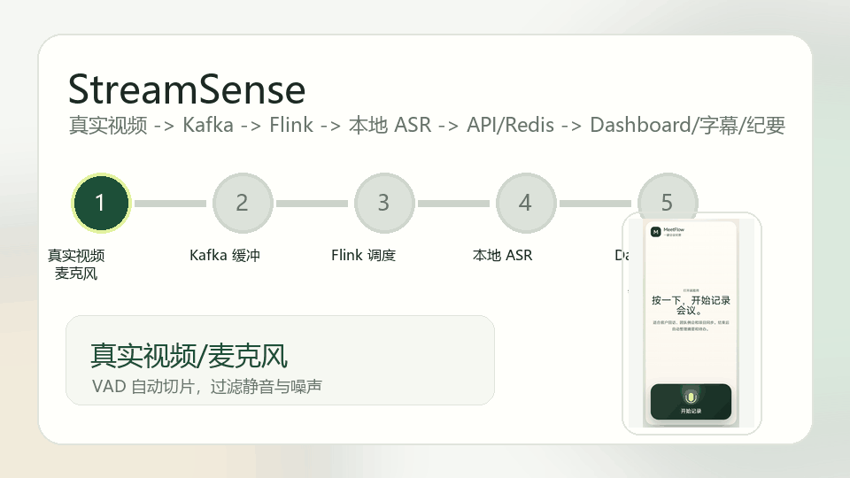
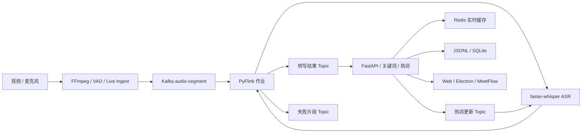
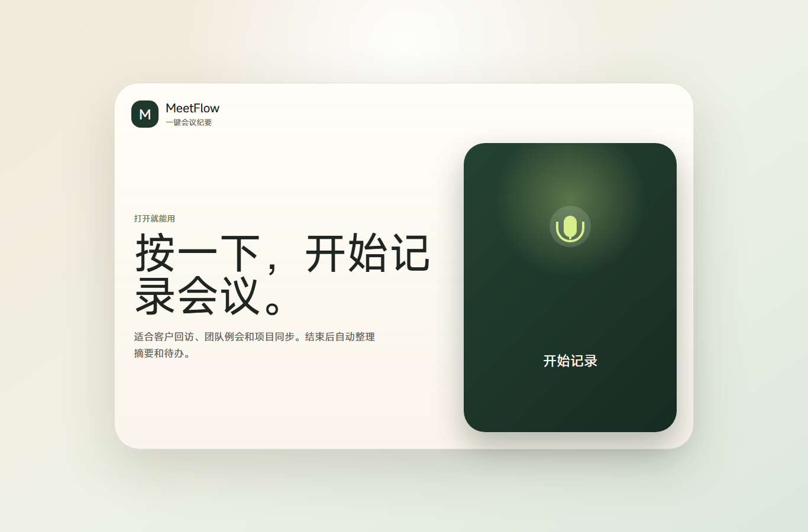
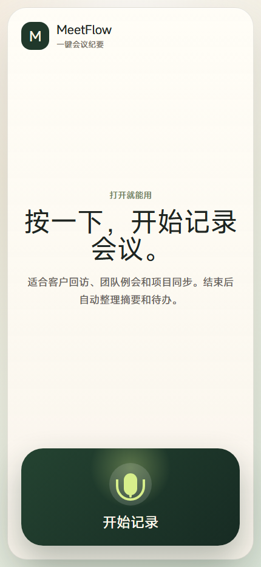

<p align="center">
  
</p>
<h1 align="center">StreamSense</h1>
<p align="center"><strong>基于 Kafka-Flink 的视频流语音转写与关键词分析系统</strong></p>
<p align="center">视频与语音接入 · 流式调度 · 本地 ASR · 实时观测 · 字幕质量评测</p>

<p align="center">
  
  
  
  <a href="LICENSE"></a>
</p>
<p align="center">
  <a href="#项目亮点">项目亮点</a> · <a href="#实测结果">实测结果</a> · <a href="#快速开始">快速开始</a> · <a href="#四端交付">四端交付</a> · <a href="docs/usage-and-validation.md">使用与验证手册</a>
</p>

---

StreamSense 将视频、麦克风音频组织成一条可观察的实时处理链路：**FFmpeg / VAD 切片 → Kafka 缓冲 → Flink 调度 → faster-whisper 转写 → 关键词与热词分析 → API / 客户端展示**。

除了字幕结果，每个片段还保留端到端、ASR 与调度耗时，以及失败和重试信息。Web 看板、两个 Electron 客户端和 MeetFlow 移动端共享后端能力，支持从本地实验、结果复核到会议记录的完整演示。

## 项目亮点

| 方向 | 已实现能力 |
| :--- | :--- |
| 流式处理 | 本地视频 / RTSP / HTTP/FLV 接入，WebRTC VAD 动态切片，五个 Kafka Topic，PyFlink 调度与失败重试 |
| 本地识别 | faster-whisper、能量 / 置信度 / 重复模式过滤、繁简转换、领域词表与纠错 |
| 关键词与热词 | 自定义词表、TextRank、词频兜底，滑动窗口热词发现与确认 / 忽略 / 纠错 |
| 可观测与追溯 | 分阶段延迟、P95、吞吐增量、失败片段、指标历史；Redis、JSONL、SQLite 分层保存 |
| 多路与导出 | 按 stream_id 查询、导出、清理和查看热词；SRT / VTT / TXT / JSON / ZIP 输出与字幕编辑 |
| 质量与验证 | CER / WER、关键词命中率、字幕覆盖缺口、并发压测、六项服务冒烟检查与轻量单元测试 |
| 交付形态 | Web Dashboard、离线 Electron 工作台、实时 Electron 采集端、MeetFlow 手机 / 平板 App |
| 可选增强 | subtitle-agent：LLM + RAG 字幕审校与术语统一，需单独配置模型 API |

<p align="center">
  
</p>
<p align="center"><sub>项目演示素材；后端指标和实际处理结果可通过 API 与离线记录核对。</sub></p>

## 实测结果

以下是仓库已有的单机并发测试记录，本次文档更新未重跑压测：

| 视频并发 | 处理片段 | 失败片段 | 平均端到端延迟 | P95 延迟 | 观察 |
| :--- | ---: | ---: | ---: | ---: | :--- |
| **2 路** | **230** | **0** | **约 4.1 s** | **约 6.8 s** | 单机参考基线 |
| **4 路** | 39 | 0 | 约 9.9 s | 约 14.5 s | ASR 排队造成延迟上升 |

结果体现该环境下的并发与延迟取舍；两组处理片段数不同，不能外推为多节点吞吐或生产稳定性。完整方法与条件见 [性能压测实验报告](docs/性能压测实验报告.md)，复测入口为 `tools/benchmark_streamsense.py`。

## 系统架构


```mermaid
flowchart LR
  V[视频 / 麦克风] --> I[FFmpeg / VAD / Live Ingest]
  I --> K[Kafka audio-segment]
  K --> F[PyFlink 作业]
  F --> A[faster-whisper ASR]
  A --> F
  F --> T[转写结果 Topic]
  F --> X[失败片段 Topic]
  T --> API[FastAPI / 关键词 / 热词]
  API --> R[Redis 实时缓存]
  API --> S[JSONL / SQLite]
  API --> UI[Web / Electron / MeetFlow]
  API --> H[热词更新 Topic]
  H --> A
```

## 快速开始

### 环境

Docker Desktop（Linux 容器引擎）与 Docker Compose；默认 ASR 配置使用 NVIDIA GPU。离线工具需要 Python 3.11+，前端需要 Node.js / npm。首次启动需下载模型，网络和 GPU 驱动需就绪。

```powershell
git clone https://github.com/NJNAN/kafka-flink-video-streaming-asr.git
cd kafka-flink-video-streaming-asr
Copy-Item .env.example .env
# 将测试视频放到 videos/input.mp4
docker compose up -d --build
docker compose ps
python tools/smoke_check.py
```

已有 `.env` 时保留配置，按 `.env.example` 核对必要项。CPU 模式需将 `ASR_DEVICE=cpu`、`ASR_COMPUTE_TYPE=int8`、模型调整为适当规模，并移除 Compose 中 ASR 的 `gpus: all`。

| 入口 | 地址 |
| :--- | :--- |
| 实时字幕、关键词与指标看板 | [localhost:8000](http://localhost:8000) |
| API 健康检查 | [localhost:8000/health](http://localhost:8000/health) |
| ASR 健康检查 | [localhost:8001/health](http://localhost:8001/health) |
| Flink Web UI | [localhost:8081](http://localhost:8081) |

各服务的 Python 依赖独立管理，根目录 `requirements.txt` 用于本地工具入口；服务、桌面端和移动端配置详见 [使用手册](docs/usage-and-validation.md#3-运行环境)。

## 四端交付

| 交付端 | 入口 | 用途 |
| :--- | :--- | :--- |
| Web Dashboard | `services/api/static/` | 实时字幕、关键词、指标曲线、失败片段与运行状态 |
| 离线 Electron 工作台 | `desktop-ui/` | 本地视频转字幕、任务进度、时间轴编辑、质量报告和多格式导出 |
| 实时 Electron 采集端 | `desktop-ui-live/` | 启停服务、健康检查、摄像头 / 麦克风采集、分片上传与实时字幕 |
| MeetFlow 手机 / 平板 | `meeting-assistant-tablet/` | 1.8 秒音频分片、热词上传、会议文字、摘要、待办与原文摘录；HTTPS PWA / Android APK |

<p align="center">
  
  
</p>

客户端启动、实时 Compose 与 Android 构建步骤见 [前端与移动端验收](docs/usage-and-validation.md#124-前端与移动端验收)。

## 验证与结果留存

```powershell
# 无需 Docker / GPU 的轻量测试
python -m unittest discover -s tests -v
# 运行中的服务检查：API、ASR、Flink、Docker、Topic、指标
python tools/smoke_check.py
# 合成 / 自备视频的字幕生成与质量复核
python tools/generate_video_subtitles.py --media-path videos/input.mp4 --output-dir data/results/demo
python tools/evaluate_subtitles.py --help
# 多路并发压测配置
python tools/benchmark_streamsense.py --help
```

在线结果可按 stream_id 查询、导出与清理；清理演示数据会删除该流的历史，操作前先导出。JSONL 用于片段追溯，SQLite 用于结构化统计，Redis 用于实时查询。完整 API、数据字段、Topic 设计与指标解释见 [使用与验证手册](docs/usage-and-validation.md)。

## 项目结构

```text
StreamSense/
├── assets/branding/           项目 Logo
├── config/                    领域 Profile、热词与纠错
├── services/                  视频接入、ASR、API 与 Web Dashboard
├── flink/                     PyFlink 消费、推理调度与结果写回
├── desktop-ui/                离线 Electron 工作台
├── desktop-ui-live/           实时采集端与 Live Ingest
├── meeting-assistant-tablet/  MeetFlow PWA / Android
├── subtitle-agent/            可选 LLM + RAG 字幕增强
├── tools/                     字幕生成、评测、压测与冒烟检查
├── tests/                     轻量回归测试
├── docs/                      配置说明、实验报告与界面素材
└── docker-compose.yml         后端服务编排
```

## 当前边界

项目定位为单机原型与本地实验，尚未验证多节点生产集群。模型识别会受音频、术语、噪声和并发排队影响；热词与质量过滤的存在不代表已经量化了所有场景的准确率收益。可选 AI 增强模块需要网络与单独的 API 配置。

## 文档与许可

- [详细使用与验证](docs/usage-and-validation.md)：技术选型、数据规格、所有功能与验收步骤。
- [文档导航](docs/文档导航.md)：部署、质量评测、性能实验和问题解决文档。
- [性能压测实验报告](docs/性能压测实验报告.md)：现有 2 路 / 4 路结果与条件。
- [MIT License](LICENSE)：项目许可。
