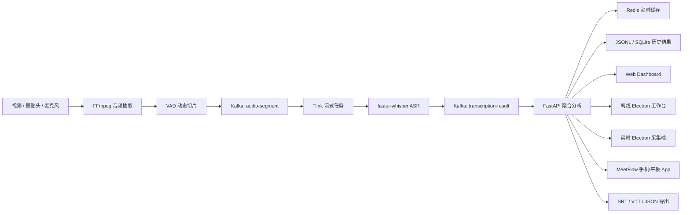
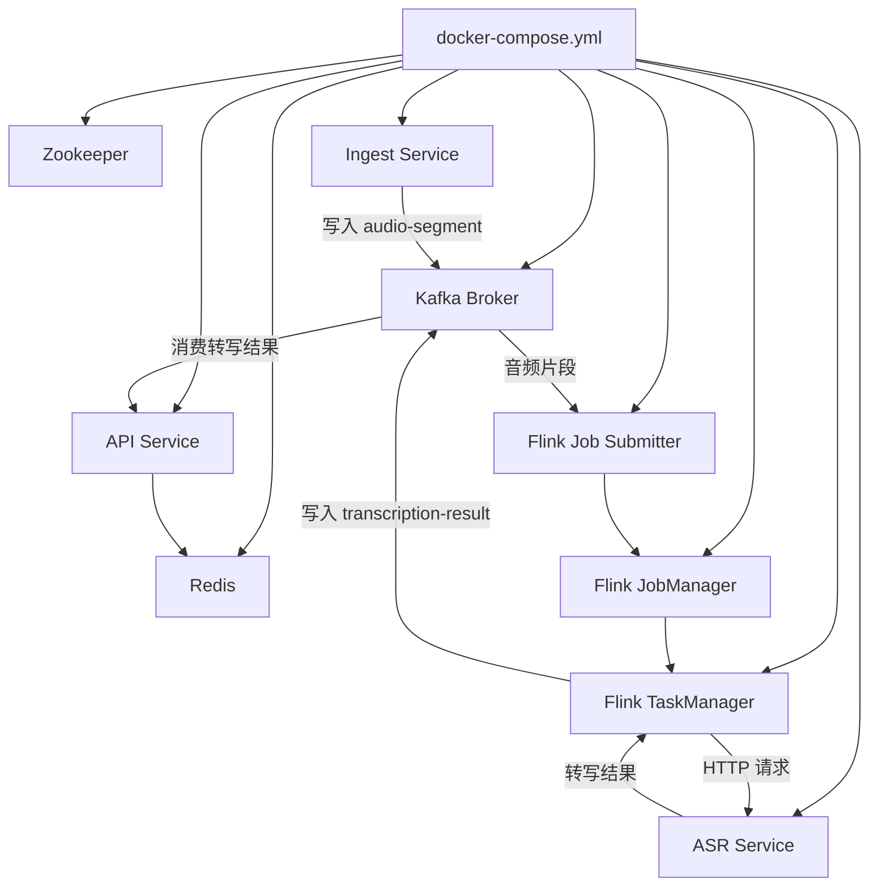
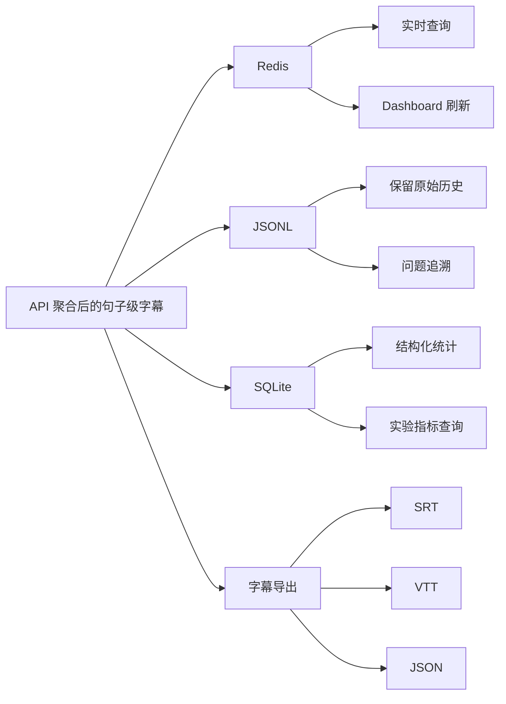

# StreamSense 原理解说

这份文档解释 StreamSense 为什么要这样设计，适合用于理解系统架构、排查链路问题和做二次开发。

## 1. 项目要解决什么问题

普通视频转字幕脚本一般是：

```text
视频 -> ASR -> 字幕
```

这种方式能做单文件字幕，但很难呈现实时处理、关键词分析、服务状态和模块解耦。

本项目把问题拆成多个模块：

```text
视频接入 -> 消息队列 -> 流处理 -> ASR 服务 -> 结果分析 -> 可视化展示
```

这样既能生成字幕，又能体现 Kafka 和 Flink 在实时数据处理里的作用。

## 2. 整体流程

```text
真实视频
  -> FFmpeg 抽出音频
  -> VAD 按语音停顿切片
  -> Kafka 保存音频片段消息
  -> Flink 消费消息并调用 ASR
  -> faster-whisper 识别文字
  -> Kafka 保存转写结果
  -> API 做句子合并、关键词分析、结果保存
  -> Dashboard / Electron / MeetFlow / 字幕文件
```

每一步只负责一件事。这样系统出了问题时，可以单独看某个服务日志，而不是所有逻辑挤在一个脚本里。

### 2.1 结构图



### 2.2 组件关系图



### 2.3 结果存储关系图



## 3. 为什么用 Kafka

Kafka 在这里负责“传话”和“缓冲”。

视频接入服务只需要把音频片段信息写到 Kafka，不需要关心后面是谁识别、识别多久、结果怎么展示。

Flink 只需要从 Kafka 读消息，不需要直接控制 FFmpeg。

好处是：

- 接入和处理解耦。
- ASR 慢一点时，消息可以先堆在 Kafka 里。
- 后续可以增加更多消费者，比如情感分析、摘要生成、敏感词检测。
- Topic 可以清楚表达数据流向。

本项目主要 Topic：

| Topic | 作用 |
|---|---|
| `audio-segment` | 音频切片元数据 |
| `transcription-result` | ASR 转写结果 |
| `keyword-event` | 关键词事件 |
| `streamsense.hotword.updates` | 动态热词更新 |

`topic-init` 容器会在启动时提前创建 Topic，避免第一次运行时 Flink 因为 Topic 不存在而失败。

## 4. 为什么用 Flink

Flink 是实时流处理层。

在本项目里，Flink 的主要工作是：

1. 从 Kafka 的 `audio-segment` 读取音频片段消息。
2. 根据消息里的音频路径、时间戳、视频 ID 调用 ASR 服务。
3. 把识别结果写回 Kafka 的 `transcription-result`。

它不是直接做深度学习推理。原因是 Whisper 依赖比较重，把 CUDA、PyTorch、模型加载全塞进 Flink 容器会很难维护。

所以项目采用：

```text
Flink 负责调度
ASR 服务负责模型推理
```

这样分工更清楚，也更符合工程实践。

## 5. 为什么 ASR 要单独做成服务

ASR 服务封装了 `faster-whisper`。

它单独存在有几个好处：

- 模型只需要加载一次，不用每个任务重复加载。
- GPU 资源集中管理。
- Flink、字幕脚本、其他工具都可以调用同一个 ASR HTTP 接口。
- 模型参数可以通过 `.env` 调整。
- 后续替换模型时，不需要大改 Kafka 和 Flink。

常见配置：

```text
ASR_MODEL=large-v3
ASR_DEVICE=cuda
ASR_COMPUTE_TYPE=float16
ASR_LANGUAGE=zh
```

如果没有 GPU，可以改成：

```text
ASR_DEVICE=cpu
ASR_COMPUTE_TYPE=int8
```

## 6. 为什么要 VAD 动态切片

最简单的切片方式是每 6 秒切一次：

```text
0-6 秒
6-12 秒
12-18 秒
```

问题是，句子可能刚说到一半就被切断，导致 ASR 输出不自然，甚至漏字。

VAD 的意思是 Voice Activity Detection，也就是检测哪里有人声、哪里是静音。

本项目用 VAD 尽量按停顿切：

```text
语音开始 -> 中间有人声 -> 停顿处结束
```

这样字幕更接近自然句子。

关键参数：

```text
INGEST_SEGMENT_MODE=vad
INGEST_VAD_TARGET_CHUNK_MS=3000
INGEST_VAD_HARD_MAX_CHUNK_MS=4500
INGEST_VAD_MAX_SILENCE_MS=1400
```

含义：

- `TARGET_CHUNK`：希望片段大概多长。
- `HARD_MAX_CHUNK`：最长不能超过多长。
- `MAX_SILENCE`：静音多久后认为可以断开。

## 7. 为什么还要句子缓冲

VAD 已经比固定切片好，但它仍然可能把一句话切成多个短片段。

所以 API 层做了句子缓冲：

```text
短片段 1 + 短片段 2 + 短片段 3 -> 更完整的一句话
```

这样 Dashboard 里看到的不是零碎短句，而是更适合阅读的字幕句子。

相关配置：

```text
SENTENCE_BUFFER_ENABLED=true
SENTENCE_MAX_CHARS=110
SENTENCE_FLUSH_GAP_MS=1500
SENTENCE_STALE_FLUSH_MS=3000
```

## 8. 为什么有热词和纠错

通用 ASR 模型不一定认识课程视频里的专有名词。

例如：

```text
Kafka
Flink
WebRTC
算法名称
课程名词
```

项目提供两类增强：

1. `config/custom_keywords.txt`：告诉系统哪些词比较重要。
2. `config/asr_corrections.txt`：把常见错字替换成正确写法。

同时 API 会从真实转写中统计高频词，再通过 `streamsense.hotword.updates` 广播给 ASR 服务。

这叫动态热词发现。

## 9. 为什么同时有流式链路、字幕脚本和四个交付端

项目里有两种使用方式。

第一种是完整流式链路：

```text
docker compose up -d --build
```

它适合展示系统架构、Dashboard、Kafka、Flink、实时处理。

第二种是最终字幕脚本：

```powershell
python tools/generate_video_subtitles.py --media-path videos/input.mp4 --output-dir data/results/input --basename input
```

它适合生成最终可用的字幕文件。脚本会更关注字幕完整性，比如整段转写、有声区间检测和补漏。

简单理解：

- 完整流式系统：跑 Docker Compose。
- 生成最终字幕文件：跑 `generate_video_subtitles.py`。

在交付入口上，项目把同一套后端能力封装为四种形态：

| 入口 | 目录 | 解决的问题 |
| --- | --- | --- |
| Web Dashboard | `services/api/static/` | 观察实时字幕、关键词、延迟、吞吐和失败片段 |
| 离线 Electron 工作台 | `desktop-ui/` | 给本地视频生成最终字幕文件，并支持质量报告、字幕预览和导出 |
| 实时 Electron 采集端 | `desktop-ui-live/` | 采集摄像头/麦克风，经过 Live Ingest 写入 Kafka，再由 Flink 调度 ASR |
| MeetFlow 手机/平板 App | `meeting-assistant-tablet/` | 移动端采集会议语音，实时显示文字，结束后生成摘要、待办和原文摘录 |

## 10. 每个目录在系统里的角色

| 目录 | 角色 |
|---|---|
| `services/ingest` | 视频接入，抽音频，切片，写 Kafka |
| `flink` | 消费音频片段，调用 ASR，写转写结果 |
| `services/asr` | 本地 Whisper 语音识别服务 |
| `services/api` | Dashboard、关键词分析、句子缓冲、结果接口 |
| `desktop-ui-live/live-ingest` | 接收桌面端/移动端音频分片，转换后写入 Kafka |
| `tools` | 单视频字幕、批量字幕、字幕导出 |
| `config` | 热词、纠错、领域配置 |
| `desktop-ui` | React/Electron 离线字幕工作台 |
| `desktop-ui-live` | React/Electron 实时采集端 |
| `meeting-assistant-tablet` | React/Vite/Capacitor 手机和平板会议纪要 App |
| `data/audio` | 运行时音频切片 |
| `data/results` | 字幕和报告输出 |
| `models` | 本地模型缓存 |
| `videos` | 本地测试视频 |

## 11. 数据是怎么落盘的

系统会把实时结果写到：

```text
data/results
```

常见文件：

```text
*.jsonl
*.srt
*.vtt
*_subtitle.txt
*_report.json
*_hotwords.json
```

`jsonl` 适合程序继续分析，`srt/vtt/txt` 适合人工阅读或导入播放器。
