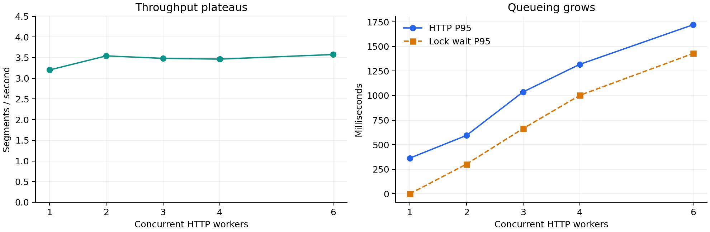
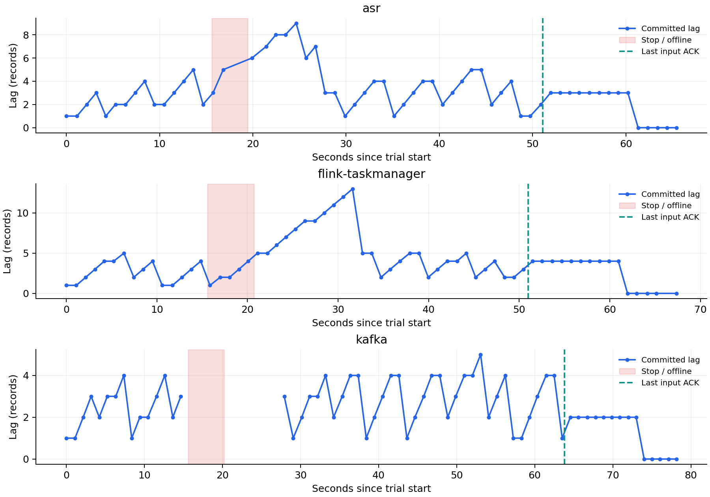

# StreamSense 可靠性与容量实测（2026-10-01）

本页由原始 JSON 自动生成；`python -m tools.reliability_report --check` 可复核数字和输入哈希。

## ASR 固定负载容量

small / CUDA / float16 / beam=5；四句公开合成音频，每档 24 请求，预热排除。HTTP 计时包含服务端等待，未经过 Kafka / Flink / 视频 VAD。

| 并发 | 请求数 | 吞吐（段/s） | HTTP P95（ms） | wait P95（ms） | hold P95（ms） | 最大队列 | CER |
|---:|---:|---:|---:|---:|---:|---:|---:|
| 1 | 24 | 3.202 | 363.01 | 0.00 | 349.22 | 0 | 1.79% |
| 2 | 24 | 3.542 | 594.05 | 301.64 | 312.91 | 1 | 1.79% |
| 3 | 24 | 3.482 | 1037.20 | 664.49 | 365.15 | 2 | 1.79% |
| 4 | 24 | 3.464 | 1317.85 | 1002.32 | 344.77 | 3 | 1.79% |
| 6 | 24 | 3.575 | 1720.95 | 1428.49 | 298.95 | 5 | 1.79% |

吞吐在这组负载上进入平台期，额外并发增加锁等待。五档文本编辑数相同；合成音频精度不能外推到自然会议。没有使用非稳态短突发数据验证 Little’s Law。

## 真实故障演练

隔离 Compose 项目 streamsense-lab，每组固定 40 个输入，间隔 1.3s，在持续生产时停一个容器 3s 后启动。stop 命令本身另有耗时；ASR 加载与 Flink 重调度均计入恢复。默认项目未被操作。

| 故障对象 | 输入/原始结果/成功 | 缺失 | 逻辑重复 | 重放交付 | 启动后首个成功（s） | 停止生产后追平（s） | max lag | 成功 SLI | ≤10s SLI |
|---|---|---:|---:|---:|---:|---:|---:|---:|---:|
| asr | 40/40/39 | 0 | 0 | 0 | 5.289 | 10.225 | 9 | 97.5% | 97.5% |
| flink-taskmanager | 40/40/40 | 0 | 0 | 0 | 6.954 | 10.952 | 13 | 100.0% | 95.0% |
| kafka | 40/40/40 | 0 | 0 | 1 | 7.588 | 10.200 | 5 | 100.0% | 97.5% |

首个成功以启动命令发起→API 收到第一个成功片段计；追平必须同时满足生产结束、原始结果齐全和 committed lag=0，包含 checkpoint 提交延迟。运行中无提交且非空的分区、broker 不可访问均为 unknown；从未有记录的空分区为零 backlog。采样周期约 1s，资源探测会增加间隔。

### 负面结果与预算

目标预设为片段成功率≥99%、≤10s 比例≥95%、停止生产后≤60s 追平。失败片段照常持久化，不能因为账本齐全就称为零失败。
- asr：成功预算剩余 -1.50，燃烧率 2.50；延迟预算剩余 0.50，燃烧率 0.50。Flink checkpoint 恢复观测：False；生产者瞬时错误 0 次。
- flink-taskmanager：成功预算剩余 1.00，燃烧率 0.00；延迟预算剩余 0.00，燃烧率 1.00。Flink checkpoint 恢复观测：True；生产者瞬时错误 0 次。
- kafka：成功预算剩余 1.00，燃烧率 0.00；延迟预算剩余 0.50，燃烧率 0.50。Flink checkpoint 恢复观测：False；生产者瞬时错误 2 次。
- 独立补偿阶段：按原始输入 ID 重放 1 个失败片段，最终成功 40/40，逻辑重复 0。补偿不会改写上表初始失败或初始 SLO。

## 语义边界与复现

Flink 默认 30s checkpoint 已存在；实验设为 5s 并存到隔离 data/checkpoints。Kafka Sink 为 AT_LEAST_ONCE，HTTP 推理是非事务副作用。SQLite 原始账本以 stream/run/segment 主键幂等，处理完成后才提交 API offset；成功结果不会因不同转写文本而重复入原始账本。Redis、关键词事件、JSONL 与内存句子缓冲不是一个事务，不能宣称端到端 exactly-once。进程崩溃时句子投影可能重复或待修复，但已收原始片段可查询、重放。

实验采用 Docker stop/start 脚本，未引入 Trogdor/Toxiproxy。单机、单 broker、短时固定合成负载，不能证明集群容灾或 30 天 SLO。旧的 4 路视频测试是 60s 冒烟，仍保留其证据并与新容量表分开。

复现命令和安全隔离约束见 [实验操作手册](可靠性实验操作手册.md)，指标见 [USE](USE资源清单.md)，预算见 [SLO](SLO.md)，精度见 [评测口径](评测口径说明.md)。

## 原始文件 SHA256

| 文件 | SHA256 |
|---|---|
| [capacity.json](../benchmarks/reliability/20261001/capacity.json) | `8a3664d869345d18294cd4d38a4b87775bff6fffbe123a21a8c8e120de2c22e7` |
| [fault-asr.json](../benchmarks/reliability/20261001/fault-asr.json) | `116772924c9181d066f2ff0ed798c745a73099f8cb1bea425eab6934e105ee06` |
| [fault-flink-taskmanager.json](../benchmarks/reliability/20261001/fault-flink-taskmanager.json) | `de2f1e4094686ba3844b04916393d7dd871ecd4c3a5644a8f0d4249a2ccb0d0b` |
| [fault-kafka.json](../benchmarks/reliability/20261001/fault-kafka.json) | `2d918a4d701af23e1d139fdf44661012d08f94b1581d350ce288e1032b196b42` |
| [replay-asr.json](../benchmarks/reliability/20261001/replay-asr.json) | `5a9c5631f379b4eb5d726988765e2e038a21e4a21ba382bfe5554be302e269fd` |
