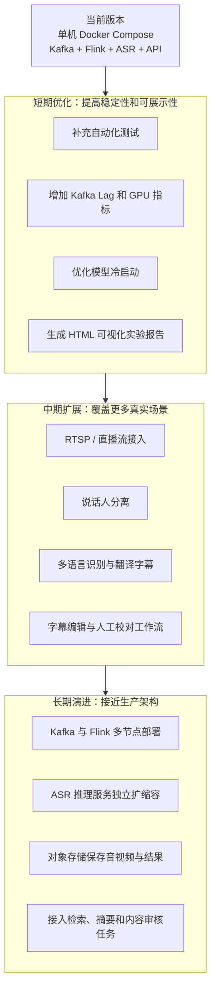

# StreamSense 问题解决与拓展路线

本文档总结 StreamSense 在实现过程中遇到的主要问题、已经落地的解决方法、当前仍存在的不足，以及后续可以继续扩展的方向。

## 1. 已解决的主要问题

### 1.1 固定切片导致字幕断裂

**问题表现**

如果机械地每隔几秒切一段音频，句子可能在中间被截断。ASR 获得的上下文不足，容易出现漏字、断句不自然和时间轴缺口。

**解决方法**

1. 在接入服务中增加 VAD 语音活动检测。
2. 按静音停顿动态决定切片边界。
3. 在 API 层增加句子缓冲，将多个短片段合并为可读句子。
4. 保留 `SENTENCE_MAX_CHARS` 和 `SENTENCE_FLUSH_GAP_MS` 等参数，方便针对不同视频调整。

**对应实现**

- `services/ingest/ingest_video.py`
- `services/api/app.py`
- `.env.example`

### 1.2 专业词和冷僻词识别不稳定

**问题表现**

通用 ASR 模型对 Kafka、Flink、WebRTC 等专业词，以及领域名词、产品名和人名的识别效果不稳定。

**解决方法**

1. 使用 `config/custom_keywords.txt` 配置重点关键词。
2. 使用 `config/asr_corrections.txt` 修正常见误识别。
3. 根据近期字幕自动统计候选热词。
4. 使用 `streamsense.hotword.updates` Topic 将动态热词广播给 ASR 服务。
5. 提供确认、忽略和纠正热词的 API。

**对应实现**

- `config/`
- `services/api/app.py`
- `services/asr/asr_service.py`

### 1.3 静音、背景音乐和噪声触发错误字幕

**问题表现**

Whisper 类模型在静音、背景音乐或低质量音频中可能输出看似流畅但实际错误的文本。

**解决方法**

1. 使用 VAD 过滤无语音片段。
2. 使用音频能量阈值过滤低能量片段。
3. 使用 `no_speech_prob`、`avg_logprob` 等阈值过滤低可信结果。
4. 过滤重复模式和常见幻觉文本。
5. 离线字幕脚本对有声区间做覆盖检查，并对缺口尝试补转写。

**对应实现**

- `services/asr/asr_service.py`
- `tools/generate_video_subtitles.py`
- `StreamSense_泛化字幕生成优化说明.md`

### 1.4 ASR 偶发失败导致片段丢失

**问题表现**

模型加载、网络波动或服务暂时繁忙时，Flink 调用 ASR 可能失败。如果直接丢弃消息，最终字幕会缺少片段。

**解决方法**

1. Flink 调用 ASR 时增加可配置重试次数。
2. 使用短间隔退避避免立即重复请求。
3. 多次失败后，将错误片段写入 `transcription-failed` Topic。
4. API 将失败片段保存到结果文件和 SQLite，便于后续查询。

**对应实现**

- `flink/transcription_job.py`
- `services/api/app.py`
- `services/api/storage.py`
- `tools/smoke_check.py`

### 1.5 Docker Desktop 恢复后 Kafka 启动失败

**问题表现**

Docker Desktop 重启后，Kafka 首次启动曾出现：

```text
KeeperException$NodeExistsException
Error while creating ephemeral at /brokers/ids/1
```

原因是 Zookeeper 中旧 Kafka broker 会话的临时节点尚未过期，新 broker 使用相同 ID 注册时发生冲突。

**解决方法**

1. 查看 Kafka、Zookeeper 和 `topic-init` 日志，确认错误来源。
2. 等待 Zookeeper 旧会话过期。
3. 单独重启 Kafka。
4. Kafka 正常监听后，再运行 `topic-init` 和 Flink 作业提交器。
5. 使用冒烟测试确认 API、ASR、Flink、Docker 服务、Kafka Topic 和指标接口全部正常。

本机恢复后执行：

```text
python tools/smoke_check.py
checks: 6
passed: 6
failed: 0
```

### 1.6 仓库容易混入大文件和本机材料

**问题表现**

模型缓存、测试视频、音频切片、字幕结果、Electron 打包目录和 `.env` 都不适合提交到 GitHub。它们体积大，可能包含本机路径或密钥，也会污染 Git 历史。

**解决方法**

1. 完善 `.gitignore`。
2. 仅保留目录占位文件 `.gitkeep`。
3. 新增 `examples/` 脱敏静态案例。
4. 在提交前执行链接检查、敏感信息扫描和 `git diff --check`。

## 2. 当前不足

### 2.1 仍然是单机演示架构

当前 Kafka、Flink、Redis、ASR 和 API 都通过 Docker Compose 部署在一台机器上。它适合本地实验和原型验证，但不能直接代表生产环境的高可用集群。

### 2.2 GPU 资源要求较高

默认 `large-v3 + cuda + float16` 更偏向准确率。没有 NVIDIA GPU 时，需要改为 CPU 模式并调整 Compose 配置，速度会明显下降。

### 2.3 首次启动时间较长

首次运行需要下载和加载 faster-whisper 模型。模型越大，下载时间、磁盘占用和显存占用越高。

### 2.4 实时延迟会受到历史消息积压影响

Flink 默认从 Kafka 的较早消息开始消费，便于避免模型首次加载时漏掉片段。但如果 Topic 中积压较多历史消息，端到端延迟会被明显拉高。

### 2.5 字幕质量仍然不能完全替代人工精校

系统可以减少明显误识别、漏段和断句问题，但复杂口音、多人重叠讲话、背景音乐和专有名词仍可能需要人工复查。

### 2.6 缺少说话人分离

当前字幕主要按时间片段组织，没有标注“谁在说话”。会议、访谈和多人视频场景的可读性仍有提升空间。

### 2.7 可视化报告仍可加强

当前已有 Dashboard、JSONL、SQLite、Markdown 报告和 API，但还缺少统一的 HTML 实验报告，以及更直观的前后对比页面。

## 3. 未来拓展路线



### 3.1 短期：完善开源原型闭环

| 方向 | 目标 | 预期收益 |
| --- | --- | --- |
| 自动化测试 | 为关键词、句子缓冲、热词更新和导出逻辑增加测试。 | 降低后续修改造成回归的风险。 |
| 指标增强 | 增加 Kafka Lag、GPU 显存、GPU 利用率和队列等待时间。 | 更准确地解释系统瓶颈。 |
| 冷启动优化 | 提供模型预下载、预热和小模型降级策略。 | 缩短首次演示等待时间。 |
| HTML 报告 | 汇总字幕、关键词、延迟曲线、失败片段和实验结论。 | 读者打开一个页面即可理解实验结果。 |

### 3.2 中期：扩展真实使用场景

| 方向 | 目标 | 预期收益 |
| --- | --- | --- |
| RTSP 接入 | 接入摄像头、直播流和网络视频流。 | 从文件演示扩展到实时场景。 |
| 说话人分离 | 标注不同发言人。 | 提升会议和访谈字幕可读性。 |
| 多语言与翻译 | 输出原文字幕和翻译字幕。 | 支持更多内容类型。 |
| 人工校对工作流 | 在桌面端保存修改历史和版本。 | 将自动生成与人工精校结合。 |

### 3.3 长期：演进为可扩展服务

| 方向 | 目标 | 预期收益 |
| --- | --- | --- |
| 多节点部署 | 将 Kafka、Flink 和 ASR 从单机 Compose 拆分为集群服务。 | 支持更多并发流。 |
| ASR 服务扩缩容 | 根据 Kafka Lag 动态调整推理实例数量。 | 缓解多路并发排队。 |
| 对象存储 | 使用 MinIO 或云对象存储保存音频片段、字幕和报告。 | 提高结果管理能力。 |
| 下游分析 | 增加摘要、检索、内容审核、主题聚类和告警。 | 从字幕系统扩展为视频内容理解平台。 |

## 4. 总结

StreamSense 当前已经形成一条可运行、可观测、可评测、可恢复的 Kafka-Flink 视频流语音处理链路。现阶段最重要的价值是完整展示真实数据如何进入消息队列、经过流式调度、本地模型推理、结果聚合和可视化输出。

后续扩展应优先围绕稳定性、指标完整度和真实场景覆盖推进，再考虑多节点部署和更多 AI 分析任务。
